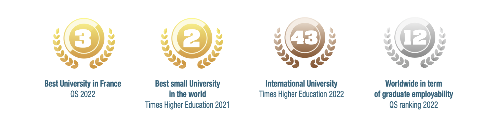
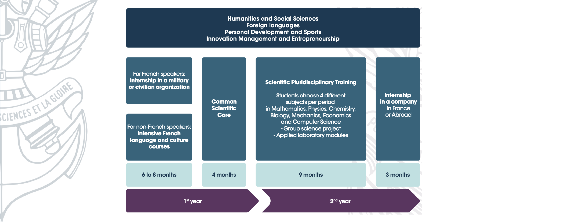
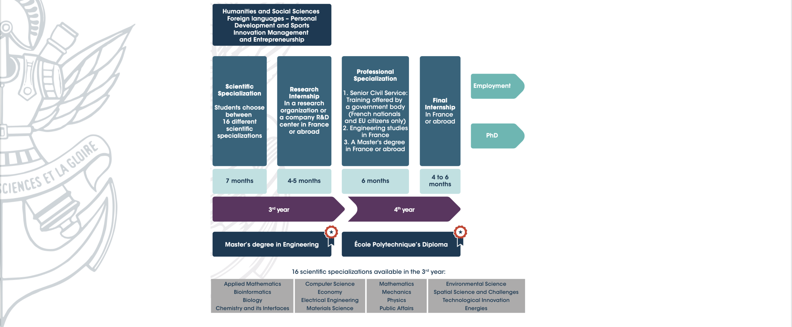

+++
author = "Laychiva Chhout"
title = "École polytechnique(X)"
date = "2023-12-27"
description = "ការចែករំលែកពីបទពិសោធន៍ផ្ទាល់ខ្លួនរបស់ខ្ញុំនៅ X"
math = "true"
tags = [
    "others",
]
categories = [
    "Others"
]
series = ["Themes Guide"]
aliases = ["migrate-from-jekyl"]
image = "cover.jpeg"
+++


{{ if or .Page.Params.math .Site.Params.math }}
<!-- KaTeX -->
<link rel="stylesheet" href="https://cdn.jsdelivr.net/npm/katex@0.11.1/dist/katex.min.css" integrity="sha384-zB1R0rpPzHqg7Kpt0Aljp8JPLqbXI3bhnPWROx27a9N0Ll6ZP/+DiW/UqRcLbRjq" crossorigin="anonymous">

{{ end }}


## អំពី X

ស្ថិតនៅភាគខាងត្បូងទីក្រុងប៉ារីស សាលាប៉ូលីតិចនិចជាសាលាចំណាស់មួយរបស់ប្រទេសបារាំងដែលសាលានេះត្រូវបានបង្កើតឡើងនៅក្នុងឆ្នាំ ១៧៩៤ ដោយស្តេច ណាប៉ូឡេអុងទី១ ដោយពេលនោះសាលានេះត្រូវបានបង្កើតឡើងដើម្បីបណ្តុះបណ្តាលធនធានមនុស្សបច្ចេកទេសជាន់ខ្ពស់ដើម្បីចូលរួមក្នុងការកសាងសង្គមជាតិរបស់ប្រទេសបារាំង។ សាលាប៉ូលីតិចនិចមានឈ្មោះល្បីទូទាំងពិភពលោកដោយសារតែគុណភាពនៃការអប់រំដែលសាលានេះតែងតែរក្សានូវចំណាត់ថ្នាក់ល្អប្រសើរក្នុងចំណោមគ្រឹះស្ថានឧត្តមសិក្សាល្បីៗលើពិភពលោក។ 

សាលានេះបានផលិតនូវបញ្ញវន្តជាច្រើនដោយក្នុងនោះមានអ្នកប្រាជ្ញគណិតវិទ្យា រូបវិទ្យា សេដ្ឋវិទូ អ្នកនយោបាយ និងអ្នកជំនួញ ដោយក្នុងនោះមានដូចជា Elisabeth Borne(Prime Minister of France), Jean Tirole(Nobel Prize winner 2014), Henri Bacquerel(Nobel Prize winner 1903), Augustin Fresnel, Joseph-Louis Gay-Lussac ជាដើម។ លក្ខណៈពិសេសមួយផ្សេងទៀតរបស់សាលានេះគឺ សាលានេះស្ថិតនៅក្រោមការគ្រប់គ្រងរបស់ក្រសួងការពារជាតិបារាំង ដែលសិស្សទាំងអស់ដែលសិក្សានៅទីនេះត្រូវគោរពវិន័យ និងចូលរួមក្នុងកម្មវិធីផ្សេងៗដែលមានលក្ខណៈ និងច្បាប់ដូចទៅនឹងទាហានបារាំងដែរ ដូចជាការដើរដេហ្វីឡេក្នុងថ្ងៃបុណ្យជាតិរបស់ប្រទេសបារាំង(Défilé du 14 juillet) ជាដើម។

<!--  -->

## ការត្រៀមខ្លួន និងការប្រឡងចូលរៀន 

ក្នុងចំណុចនេះខ្ញុំសូមផ្តោតតែលើការត្រៀមខ្លួនរបស់និស្សិតខ្មែរយើងដោយផ្អែកតាមបទពិសោធន៍របស់ខ្ញុំតែប៉ុណ្ណោះ។

ដើម្បីមានសិទ្ធប្រឡងចូលរៀនសាលានេះបាននិស្សិតខ្មែរត្រូវគោរពលក្ខខណ្ឌជាច្រើនដែលបានដាក់ចេញដោយសាលាដោយនៅក្នុងនោះលក្ខខណ្ឌដែលពិបាកជាងគេគឺចំណេះដឹងគណិតវិទ្យា និងរូបវិទ្យា។ ដើម្បីដាក់ពាក្យប្រឡងបាននិស្សិតខ្មែរត្រូវតែជានិស្សិតដែលបានសិក្សាយ៉ាងតិច២ឆ្នាំក្នុងកម្រិតបរិញ្ញាបត្រ (Graduate Degree) ក្នុងជំនាញដែលទាក់ទងទៅនឹងវិទ្យាសាស្រ្ត គណិតវិទ្យា ឬរូបវិទ្យា ដោយនិស្សិតនោះត្រូវមានចំណេះដឹងផ្នែកគណិតវិទ្យា និងរូបវិទ្យាជ្រៅជ្រះ និងទទួលបានលទ្ធផលល្អប្រសើរក្នុងការសិក្សារបស់ខ្លួន។ ជាទូទៅលក្ខខណ្ឌនេះមានភាពសមស្របជាមួយការសិក្សាឆ្នាំមូលដ្ឋាននៃសាលាតិចណូ ដែលក្នុងនោះនិស្សិតនៃសាលាតិចណូតម្រូវឱ្យសិក្សា គណិតវិទ្យា និងរូបវិទ្យាកម្រិតបរិញ្ញាបត្រ ដែលជាហេតុបណ្តាលឱ្យនិស្សិតពូកែនៃសាលាតិចណូតែងតែប្រឡងជាប់ចូលរៀននៅសាលានេះសឹងតែជារៀងរាល់ឆ្នាំ។ ការប្រឡងចូលរៀនរបស់សាលានេះតែងតែធ្វើឡើងក្នុងខែតុលា ឬវិច្ឆិការៀងរាល់ឆ្នាំ ដោយបើកឱ្យដាក់ពាក្យនៅខែមិថុនា ឬកក្កដា។ ការដាក់ពាក្យប្រឡងចូលរៀននេះត្រូវបានបែងចែកជាពីរដំណាក់កាល៖ ១.ការជ្រើសរើសបេក្ខជនដែលអាចមានសិទ្ធប្រឡង និង ២.ការប្រឡង។ 

### ១. ការជ្រើសរើសបេក្ខជនដែលអាចមានសិទ្ធប្រឡង

និស្សិតដែលចង់ដាក់ពាក្យប្រឡងត្រូវផ្ញើ(Submit) ឯកសារផ្សេងៗដែលមានដូចជា ពិន្ទុសិក្សា, សញ្ញាបត្រផ្សេងៗ, Statement of purpose និង CV ជាដើម នៅក្នុងគេហទំព័ររបស់សាលាដោយផ្ទាល់។ ខាងសាលានឹងធ្វើការជ្រើសរើសបេក្ខជនដែលមានសិទ្ធិក្នុងការប្រឡងដោយផ្អែកទៅលើឯកសារទាំងនេះ បើសិនជាបេក្ខជនទទួលបានភ្លើងខៀវនោះពួកគេនឹងត្រូវបានបន្តទៅជុំក្រោយ ពោលគឺជាការប្រឡង។

### ២.ការប្រឡង

នៅមុនឆ្នាំ២០២០ការប្រឡងចូលរៀនតែងតែធ្វើឡើងនៅសាលាតិចណូ ត្រួតពិនិត្យដោយសាស្រ្តាចារ្យរបស់ X ទៅពីប្រទេសបារាំងដោយផ្ទាល់ ដោយក្នុងនោះមានការប្រឡងសរសេរ និងប្រឡងផ្ទាល់មាត់លើមុខវិជ្ជា គណិតវិទ្យា រូបវិទ្យា និងចំណេះដឹងវិទ្យាសាស្រ្តទូទៅ។ តែក្រោយឆ្នាំ២០២០ដោយសារបញ្ហាកូវីដការប្រឡងត្រូវបានផ្លាស់ប្តូរទៅជាការប្រឡងតាម Online ដែលរៀបចំដោយសាលាបារាំង IFC(Insitut Francais du Cambodge) ដែលជាការប្រឡងផ្ទាល់មាត់លើមុខវិជ្ជា គណិតវិទ្យា រូបវិទ្យា និងចំណេះដឹងវិទ្យាសាស្រ្តទូទៅ។ ក្នុងកំឡុងពេលប្រឡងផ្ទាល់មាត់និស្សិតនឹងទទួលបានលំហាត់ពីលោកគ្រូដែលជាអ្នកត្រួតពិនិត្យ ហើយនិស្សិតត្រូវដោះស្រាយលំហាត់នោះក្នុងរយៈពេល៤៥នាទី ដោយពន្យល់ទៅកាន់អ្នកត្រួតពិនិត្យ ការធ្វើបែបនេះនិស្សិតត្រូវព្យាយាមនិយាយ និងពន្យល់ឱ្យបានក្បោះក្បាយដើម្បីបង្ហាញអ្វីដែលខ្លួនចេះទៅកាន់អ្នកត្រួតពិនិត្យ ក្នុងករណីដែលនិស្សិតទាក់ ឬមិនអាចដោះស្រាយបាននិស្សិតមានសិទ្ធិក្នុងការពិភាក្សា ឬសួរទៅក្នុងអ្នកត្រួតពិនិត្យបាន។ 
ដើម្បីធានាថាការប្រឡងនៅប្រព្រឹត្តិទៅដោយរលូននោះនិស្សិតត្រូវតែត្រៀមខ្លួនលើមុខវិជ្ជាគណិតវិទ្យា និងរូបវិទ្យា ដែលបានបញ្ចាក់នៅក្នុងតំណរនេះ៖

- គណិតវិទ្យា https://www.ip-paris.fr/sites/default/files/pages/documents/2020-09/2021-FUI-Recommended-knowledge-in-mathematics.pdf
- រូបវិទ្យា https://www.ip-paris.fr/sites/default/files/pages/documents/2020-09/2021-FUI-Recommended-knowledge-in-physics.pdf
- ប្រូបាប និងស្ថិតិ https://www.ip-paris.fr/sites/default/files/pages/documents/2020-09/Prog_proba_stat_en.pdf

ជាទូទៅនិស្សិតដែលធ្វើគណិតវិទ្យាបានច្រើនមានភាគរយជាប់ក្នុងការប្រឡងចូលរៀនច្រើន។ លទ្ធផលនៃការប្រឡងនឹងចេញប្រហែលមួយខែបន្ទាប់ពីការប្រឡងរួច និស្សិតដែលទទួលបានលទ្ធផលល្អនឹងត្រូវបានទាក់ទងដើម្បីដាក់ពាក្យស្នើរសុំអាហារូបករណ៍ផ្សេងៗ។ 

## ការសិក្សានៅសាលា X 

X មានកម្មវិធីសិក្សាជាច្រើនដូចជា ថ្នាក់បរិញ្ញាបត្រ វិស្វករ អនុបណ្ឌិត និងបណ្ឌិត នៅក្នុងអត្ថបទនេះខ្ញុំនឹងលើកយកតែថ្នាក់វិស្វករមួយតែប៉ុណ្ណោះមកនិយាយ។ 

ថ្នាក់វិស្វករ ឬ ជាភាសាបារាំង Cycle Ingénieur Polytechnicien ជាកម្មវិធីសិក្សាពិសេសខុសពីគេមួយនៅក្នុងប្រទេសបារាំងដោយសិស្សដែលបានប្រឡងជាប់ចូលរៀនសរុបទាំងអស់ ៥៥០នាក់ ត្រូវធ្វើការសិក្សារយៈពេល ៤ឆ្នាំ ដោយក្នុងនោះ៣ឆ្នាំនៅក្នុងសាលាប៉ូលីតិចនិច និង ១ឆ្នាំទៀតនៅសាលាដៃគូ។ ខ្ញុំនឹងរៀបរាប់លំអិតពីកម្មវិធីសិក្សានេះ៖

### ១. ឆ្នាំទី១ 

ឆ្នាំទី១ត្រូវបានចាប់ផ្តើមដោយការចុះកម្មសិក្សា ដោយនិស្សិតនិយាយភាសាបារាំងទាំងអស់នឹងត្រូវចុះកម្មសិក្សារយៈពេល៦ខែ ហើយនិស្សិតដែលមិនទាន់ចេះនិយាយភាសាបារាំងត្រូវទៅសិក្សាភាសាបារាំងរយៈពេល ៦ខែ ដោយក្នុងនោះ សិស្សត្រូវស្នាក់នៅផ្ទះជាមួយជនជាតិបារាំងរយៈពេល ៣ខែ និងត្រឡប់មកសិក្សានៅក្នុងសាលារយៈពេល ៣ខែ គួរបញ្ចាក់ផងដែរថានិស្សិតចាំបាច់ត្រូវមានកម្រិតភាសា C1 ដើម្បីទទួលបានសញ្ញាបត្របញ្ចប់ការសិក្សាពីសាលានេះ។ បន្ទាប់ពីបញ្ចប់កម្មសិក្សានិស្សិតទាំងអស់នឹងត្រឡប់មកសាលាហើយចូលរៀនថ្នាក់ឆ្នាំសិក្សាមូលដ្ឋានដែលមានរយៈពេលត្រឹមតេ ១០សប្តាហ៍តែប៉ុណ្ណោះ ដោយក្នុងនោះនិស្សិតត្រូវរៀនដូចជា គណិតវិទ្យា គណិតវិទ្យាអនុវត្តន៍ មេកានិចកង់ទិច សេដ្ឋកិច្ច(មីក្រូ និងម៉ាក្រូ) ព័ត៌មានវិទ្យា Cognitive Science ភាសាបារាំង និងអង់គ្លេស និងកីឡា។ ការសិក្សាមុខវិជ្ជា គណិតវិទ្យា គណិតវិទ្យាអនុវត្តន៍ មេកានិចកង់ទិច សេដ្ឋកិច្ច(មីក្រូ និងម៉ាក្រូ) ព័ត៌មានវិទ្យា នឹងត្រូវធ្វើឡើងក្នុងរយៈពេល ៣ម៉ោងកន្លះក្នុងមួយសប្តាហ៍ដែលក្នុងនោះ ១ម៉ោងកន្លះសម្រាប់មេរៀន និង ២ម៉ោងសម្រាប់លំហាត់។ សិស្សមិនមានពេលវេលាច្រើននោះទេក្នុងការសិក្សាលំអិតទៅលើចំនុចនីមួយៗ ខ្ញុំសូមលើកឧទាហរណ៍មួយដើម្បីឱ្យងាយយល់ នៅតិចណូមេរៀនមួយយើងនឹងសិក្សាក្នុងរយៈពេល ៣ ទៅ ៤ សប្តាហ៍ តែនៅ X យើងមានពេលត្រឹមតែមួយសប្តាហ៍ប៉ុណ្ណោះ ដូចច្នេះការសិក្សាបែបនេះធ្វើឱ្យយើងមានភាពលំបាក់យ៉ាងខ្លាំងព្រោះវាខុសឆ្ងាយពីការសិក្សានៅខ្មែរយើង។ ចំពោះម៉ោងកីឡាវិញសិស្សត្រូវជ្រើសរើសកីឡាមួយប្រភេទ ក្នុងចំណោម ១៦ប្រភេទកីឡាដែលមានដូចជា (Badminton, Fencing, Judo, Swimming
Basketball, Football, Orienteering and trekking, Tennis
Boxing, Handball, Rowing, Cross-training
Climbing, Horse riding, Rugby, Volleyball) ដើម្បីហាត់ជារៀងរាល់សប្តាហ៍ក្នុងរយៈពេល ៣ឆ្នាំនេះ ដោយមួយសប្តាហ៍សិស្សត្រូវហាត់រយៈពេល ៦ម៉ោងនៅឆ្នាំទី១។ 

### ២. ឆ្នាំទី២ 

នៅក្នុងឆ្នាំទី២ការសិក្សានឹងត្រូវបែងចែកជា៣ត្រីមាស ក្នុងមួយត្រីមាសរយៈពេល៣ខែ និងសិស្សត្រូវចុះកម្មសិក្សារយៈពេល១២សប្តាហ៍ដើម្បីបញ្ចប់ឆ្នាំទី២នេះ។ ក្នុងត្រីមាសនីមួយៗ សិស្សត្រូវជ្រើសរើសមុខវិជ្ជាវិទ្យាសាស្រ្តចំនួនបី ដោយមិនរាប់បញ្ចូលនូវភាសា និង មេរៀនផ្សេងៗដូចជា ទស្សនៈវិទ្យា កីឡា និង extracurricular activity។ សរុបទៅក្នុងរយៈពេល៣ត្រីមាសនេះសិស្សត្រូវរើសមុខវិជ្ជាវិទ្យាសាស្រ្តសរុបទាំងអស់ចំនួន ១២ ក្នុងលក្ខខណ្ឌមួយគឺ១២មុខវិជ្ជានេះត្រូវរើសចេញពី ៤ មហាវិទ្យាល័យផ្សេងគ្នាដូចជា Mathematics, Physics, Chemistry, Biology, Mechanics, Economics and Computer Science។ 
ការធ្វើបែបនេះតម្រូវឱ្យសិស្សទទួលបាននូវចំណេះដឹងទូលំទូលាយ និងអាចស្វែងយល់ពីអ្វីដែលខ្លួនពិតជាចូលចិត្តបាន។ ដូចឆ្នាំទីមួយដែរមុខវិជ្ជានីមួយៗមានរយៈពេល ១០សប្តាហ៍ប៉ុណ្ណោះដើម្បីសិក្សា។ បន្ថែមពីការសិក្សានេះនិស្សិតក៏តម្រូវឱ្យធ្វើគម្រោង(Group science project) មួយជាមួយសិស្សបារាំងដែលជាទូទៅមានគ្នា៥នាក់ ដែលគម្រោងនេះមានរយៈពេល៩ខែហើយមានលក្ខណៈធំ និងតម្រូវឱ្យធ្វើការស្រាវជ្រាវច្រើន។ នៅចុងឆ្នាំទី២ និស្សិតនឹងត្រូវធ្វើកម្មសិក្សានៅក្នុងក្រុមហ៊ុនដើម្បីទទួលយកនូវបទពិសោធ និងរបៀបធ្វើការនៅក្នុងក្រុមហ៊ុន។ 

### ៣. ឆ្នាំទី៣ 

ឆ្នាំទី៣ជាឆ្នាំនៃការរើសយកជំនាញ។ បន្ទាប់ពីបានសិក្សាលើមុខវិជ្ជាផ្សេងៗនៅក្នុងឆ្នាំទី២ សិស្សត្រូវសម្រេចចិត្តជ្រើសរើសយកជំនាញមួយដែលខ្លួនស្រឡាញ់ខ្លាំងជាងគេ ដែលក្នុងនោះជំនាញដែលសិស្សអាចជ្រើសរើសបានមានដូចជា Applied Mathematics, Computer Science, Mathematics, Environmental Science, Bioinformatics, Economy, Mechanics, Spatial Science and Challenges, Biology, Electrical Engineering, Physics, Technological Innovation, Chemistry and its Interfaces, Materials Science, Public Affairs, Energies ។ នៅពេលដែលសិស្សរើសយកជំនាញរួចការសិក្សានឹងត្រូវបានចែកចេញជា ២ត្រីមាស ដោយត្រីមាសនីមួយៗ សិស្សត្រូវជ្រើសរើសយក ៤មុខវិជ្ជាផ្សេងគ្នា និងត្រូវសិក្សាមេរៀនផ្សេងៗដូចជា ទស្សនៈវិទ្យា កីឡា និង extracurricular activity ដូចនៅឆ្នាំទី២ដែរ។ ហើយឆ្នាំទី៣នឹងត្រូវបញ្ចប់ដោយការចុះកម្មសិក្សាស្រាវជ្រាវក្នុងមន្ទីពិសោធន៍ ឬ ក្រុមហ៊ុន។ នៅពេលដែលសិស្សបញ្ចប់ឆ្នាំទី៣នេះសិស្សនឹងទទួលបានសញ្ញាបត្រ **Master's Degree in Engineering**។ 

### ៤. ឆ្នាំទី៤ 

ឆ្នាំទី៤ជាឆ្នាំចុងក្រោយនៃការសិក្សា ដោយសិស្សត្រូវទៅសិក្សានៅសាលាដៃគូរដែលក្នុងនោះមានសាលាល្បីៗតាមជំនាញនីមួយៗនៅក្នុងប្រទេសបារាំង និងប្រទេសផ្សេងៗ ដូចជា Stanford, Princeton, MIT, Oxford, Cambridge, ETH Zurich, Telecom Paris, Ecole des Ponts, ENS, etc. សិស្សត្រូវដាក់ពាក្យស្នើសុំដើម្បីចូលរៀននៅក្នុងសាលាទាំងអស់នេះ ដែលជាទូទៅដើម្បីជាប់បានចូលរៀននៅក្នុងសាលាល្អ លទ្ធផលសិក្សារបស់យើងនៅ X ត្រូវមានលទ្ធផលល្អប្រសើរ។ 

## Reference

https://www.polytechnique.edu

