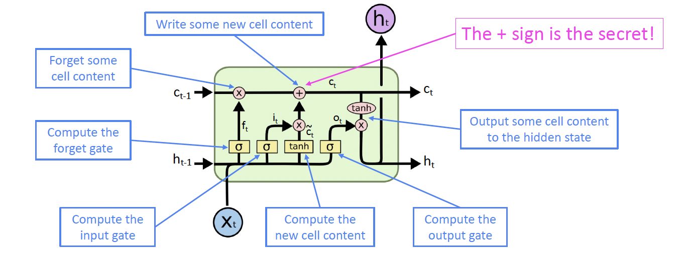
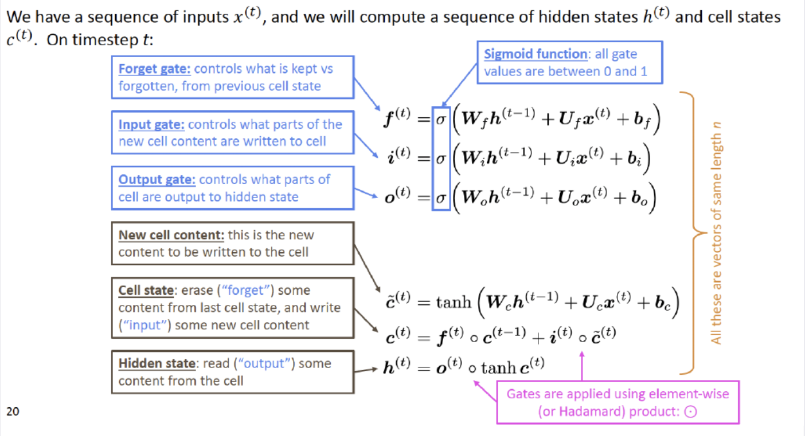

+++
author = "Laychiva Chhout"
title = "Long Short-Term Memory"
date = "2023-12-28"
description = "Fancy RNN, LSTM and its variants"
math = "true"
tags = [
    "ai",
    "ml",
    "dl",
]
categories = [
    "Artificial Intelligence",
    "Deep Learning",
]
series = ["Themes Guide"]
aliases = ["migrate-from-jekyl"]
image = "cover1.png"
+++

## 1. Introduction

In the last blog post, we talked about RNN and noted some RNN limitations that require a more sophisticated architecture to overcome these bottlenecks. In this blog post, we will talk about LSTM and its variants which are a modern or fancy architecture of the RNN.
  
Long Short Term Memory networks – usually just called “LSTMs” – are a special kind of RNN, capable of learning long-term dependencies. They were introduced by [Hochreiter & Schmidhuber (1997)](http://www.bioinf.jku.at/publications/older/2604.pdf), and were refined and popularized by many people in following work. They work tremendously well on a large variety of problems, and are now widely used. LSTMs are explicitly designed to avoid the long-term dependency problem. Remembering information for long periods of time is practically their default behavior, not something they struggle to learn!

## 2. LSTM vs RNN

LSTM is similar to RNN but with a modern architecture where it can handle the long-term dependencies better than RNN by using the gates mechanism. 

The gates mechanism can be intuitively described as following, imagine you're reading a book, and you encounter the following sentence: "John wanted to visit his friend's house, but he couldn't find the address. He spent hours searching for it."

Now, let's try to understand this sentence using both a basic [RNN](https://lchhout.github.io/blogs/post/rnn/) and an LSTM.

1. **Basic RNN:**

In a basic RNN, you can think of it as reading the sentence one word at a time, updating its internal state with each word. As you read each word sequentially, the RNN updates its understanding of the sentence. However, it has a problem with vanishing gradients when dealing with long-term dependencies(you can't remember everything in the book).

Here's how it might work:
- You start with "John" and create an initial understanding.
- You read "wanted" and update your understanding.
- You read "to visit" and update again.
- By the time you read "but," the information about "John" might start to fade away.
- And by the time you reach "hours," the information about "John" and the earlier part of the sentence may have completely vanished.
*In this case, the RNN struggles to maintain long-term dependencies, and it's challenging to remember the subject ("John") when you encounter "hours."*

2. **LSTM:**

Now, let's consider an LSTM. The LSTM has gates that allow it to control the flow of information. These gates can be thought of as filters that decide what information to remember and what to forget.

Here's how an LSTM might process the same sentence:

- When you read "John," the LSTM decides to store this information in its memory cell because it's essential for understanding the sentence.
- As you read "wanted," it updates its memory cell accordingly.
When it encounters "but," the LSTM can choose to retain the information about "John" and the earlier part of the sentence because it doesn't want to forget crucial context.
- Even when it reads "hours," the LSTM can still recall that "John" wanted to visit his friend's house, and he couldn't find the address.
- In this way, the LSTM's gates mechanism allows it to maintain and control the flow of information over time, making it better at handling long-term dependencies in sequential data, such as understanding the full context of a sentence.

So, the gates in an LSTM can be metaphorically likened to a "memory filter" that helps the network retain and access relevant information over extended sequences, enabling it to tackle long-term dependencies effectively.

## 3. Mathematical representation of LSTM

Now, let's go step-by-step through the architecture of an LSTM.

### 3.1. Forget Gate

In the example, when processing the word "but," the forget gate decides what information from the previous context ("John wanted to visit") should be retained or discarded. The forget gate, using its sigmoid function, evaluates $h_{t−1}$ (the previous hidden state) and $x_t$ (the current input, which in this case could be "but"). It outputs values between 0 and 1 for each component in the cell state $C_{t−1}$. If it outputs a value close to 1, it decides to retain the information about "John wanting to visit," but if it outputs a value close to 0, it would discard this information.

### 3.2. Input Gate

As the LSTM processes "his friend's house," the input gate decides which new information to add to the cell state. Firstly, the sigmoid layer of the input gate decides which components of the cell state should be updated with new information. Concurrently, a tanh layer creates a vector of new candidate values, $\tilde{C_t}$, which represents the new information ("his friend's house"). The input gate then combines these new candidate values with the old cell state $C_{t-1}$, scaled by the forget gate's output. This step updates the cell state with relevant new information while discarding what's deemed unnecessary.

### 3.3. Output Gate

Finally, when the LSTM arrives at "hours," the output gate determines what part of the cell state will be used in the output. This gate first applies a sigmoid function to decide which parts of the cell state are relevant to the current output. Then, the cell state is passed through a tanh function to normalize its values between -1 and 1. The output of the sigmoid gate scales this result, ensuring that only the relevant parts of the cell state (like the continued reference to "John") are included in the final output. Thus, even at "hours," the LSTM can maintain the crucial context of "John wanted to visit his friend's house."

  

<!-- ### 3.4. Recap LSTM from Stanford Slides:
 -->

## 4. GRU (Gated Recurrent Unit) - LSTM Variant

A slightly more dramatic variation on the LSTM is the Gated Recurrent Unit, or GRU, introduced by [Cho, et al. (2014)](http://arxiv.org/pdf/1406.1078v3.pdf). It combines the forget and input gates into a single “update gate.” It also merges the cell state and hidden state, and makes some other changes. The resulting model is simpler than standard LSTM models, and has been growing increasingly popular.

### 4.1. Walk Through GRU with our example

In the GRU, as we process the sentence "John wanted to visit his friend's house but couldn't find the address," the model simplifies the gate mechanisms compared to the LSTM:

- **Update Gate:** The GRU combines the forget and input gates into one "update gate." As we process each word, the update gate decides how much of the past information (from previous words) needs to be passed along to the future. For instance, when we reach "but," the update gate determines the extent to which information about "John" and "wanted to visit" should be carried forward. It effectively balances between the old information (like "John wanted to visit") and the new input ("but couldn't find the address").
- **Merging of Cell State and Hidden State:** Unlike the LSTM, the GRU merges the cell state and hidden state into a single mechanism. This makes the GRU less complex and often more efficient in terms of computation. As the sentence progresses, the GRU updates its hidden state by integrating new information (like "couldn't find the address") while maintaining relevant past information (such as "John wanted to visit").
- **Other Changes:** The GRU also simplifies the output gate process. Instead of having a separate mechanism, the output at each time step is a function of its updated hidden state. The hidden state thus captures the essence of the sentence up to the current word, taking into account the decision made by the update gate.
  

## 5. Reference

- Lecture slides of Professor: **Geoffroy Peeter, Télécom Paris.**
- Lecture slides of stanford university: https://web.stanford.edu/class/cs224n/slides/
- Blogpost: http://colah.github.io/posts/2015-08-Understanding-LSTMs/#fn1