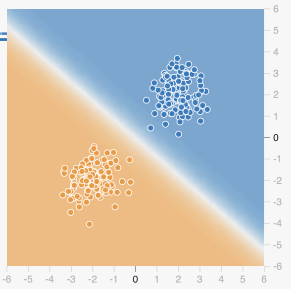
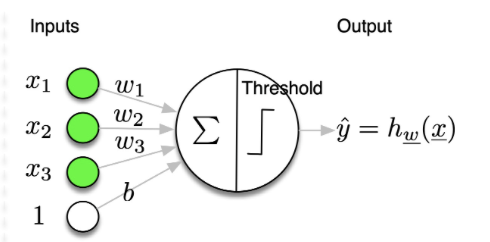
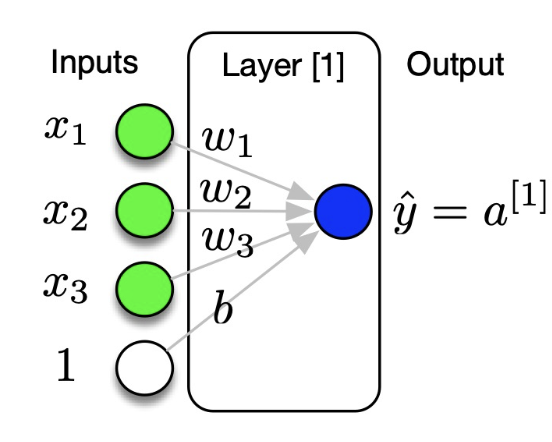
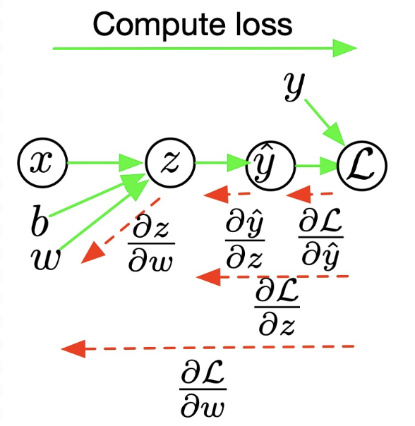
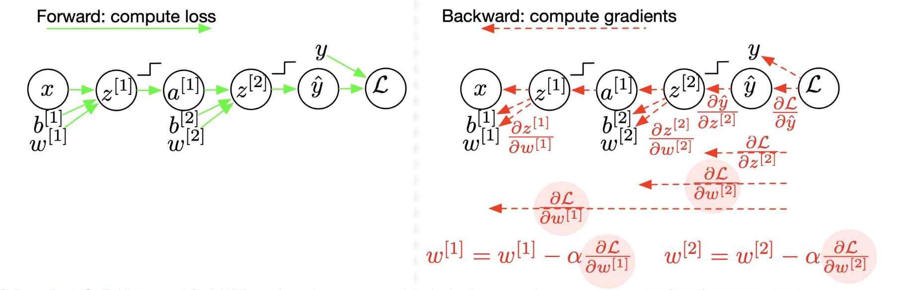
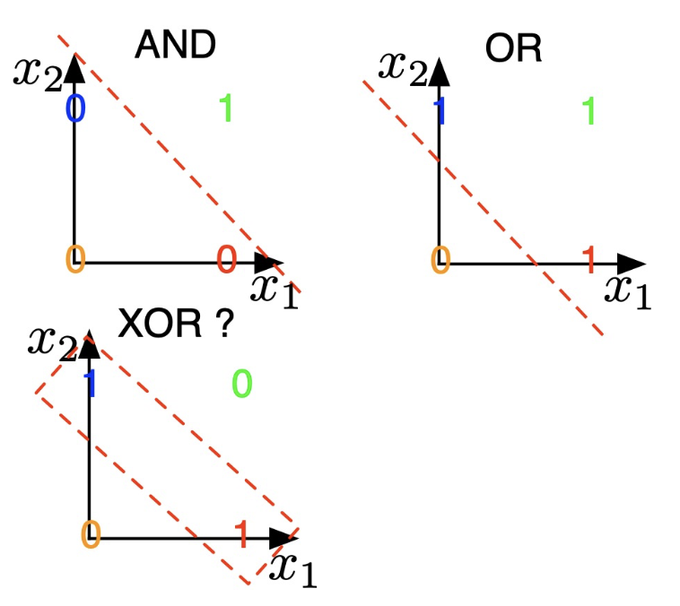
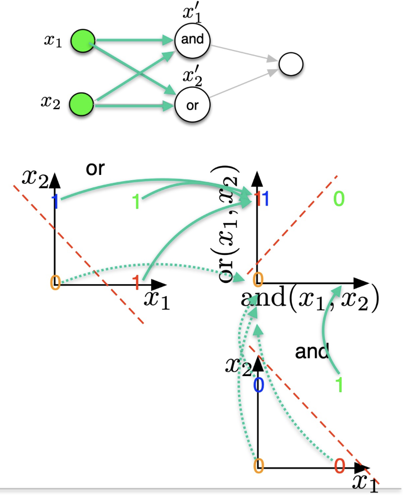
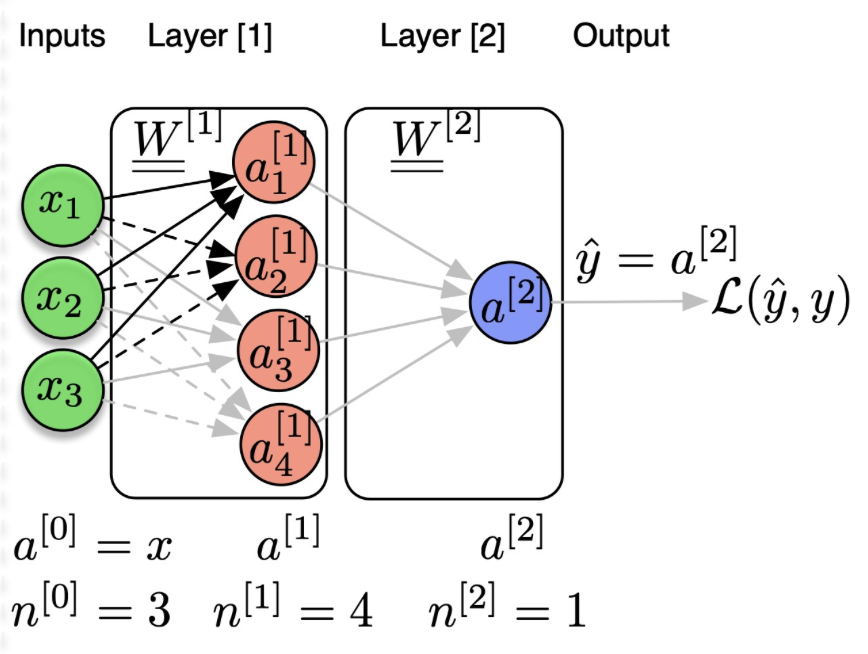
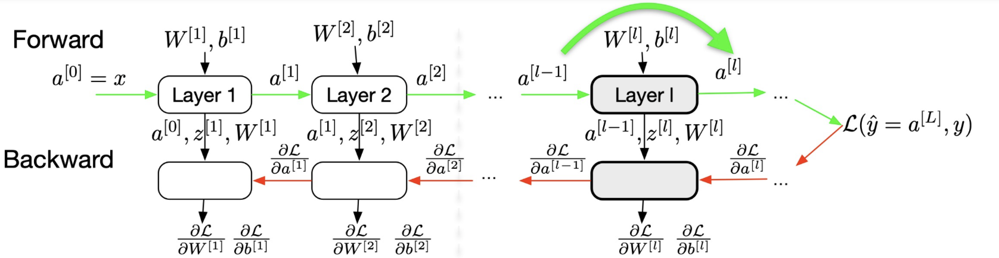
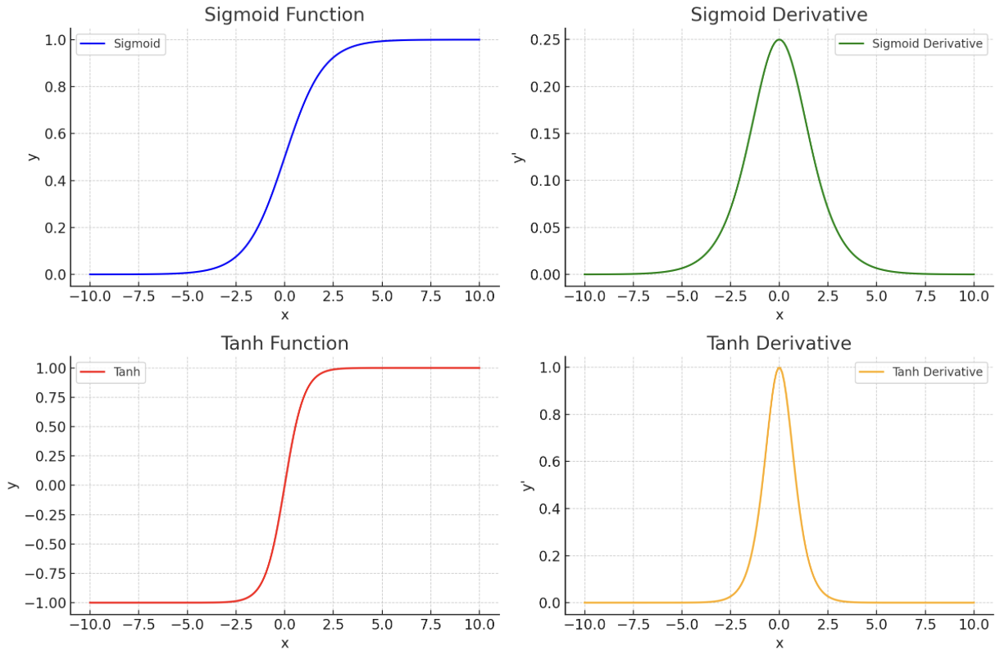

+++
author = "Laychiva Chhout"
title = "Multi-Layer Perceptron"
date = "2023-12-24"
description = "Multi-Layer Perceptron in detail."
math = "true"
tags = [
    "ai",
    "ml",
    "dl",
]
categories = [
    "Artificial Intelligence",
    "Deep Learning",
]
series = ["Themes Guide"]
aliases = ["migrate-from-jekyl"]
image = "deeplearning.png"
+++



{{ if or .Page.Params.math .Site.Params.math }}
<!-- KaTeX -->
<link rel="stylesheet" href="https://cdn.jsdelivr.net/npm/katex@0.11.1/dist/katex.min.css" integrity="sha384-zB1R0rpPzHqg7Kpt0Aljp8JPLqbXI3bhnPWROx27a9N0Ll6ZP/+DiW/UqRcLbRjq" crossorigin="anonymous">
<script defer src="https://cdn.jsdelivr.net/npm/katex@0.11.1/dist/katex.min.js" integrity="sha384-y23I5Q6l+B6vatafAwxRu/0oK/79VlbSz7Q9aiSZUvyWYIYsd+qj+o24G5ZU2zJz" crossorigin="anonymous"></script>
<script defer src="https://cdn.jsdelivr.net/npm/katex@0.11.1/dist/contrib/auto-render.min.js" integrity="sha384-kWPLUVMOks5AQFrykwIup5lo0m3iMkkHrD0uJ4H5cjeGihAutqP0yW0J6dpFiVkI" crossorigin="anonymous" onload="renderMathInElement(document.body);"></script>
{{ end }}


## Introduction to Deep Learning
Deep Learning, in contrast to traditional Machine Learning methods like XGBoost, Random Tree, Linear Regression, clustering, etc., empowers machines to acquire knowledge from data without the need for extensive prior understanding of data structure or domain-specific knowledge.
## Learning Representation
- **Rule-based systems**: Input -> Hand-designed program -> Output (Symbolic AI)
- **Classical ML**: Input -> Hand-designed features -> mapping from features (Models) -> Output
- **Representation Learning**:
	- Input -> Features -> Mapping from the Features (Model) -> Output \[Without knowing the importance of the features or domain knowledge]
	- Input -> Simple features -> Multi-Layer perceptron (Additional layers of more abstract features) -> Mapping from features -> Output

<!-- The idea behind deep learning is that we take an input and project it into a **lower-dimensional space** which will capture a lot of input detail (pixels) and all those input details are **orthogonal** and **maximize the variance**. 
- **Lower-dimensional space**: Deep learning projects inputs into a lower-dimensional space because a lower-dimensional space means that the representation of the input is more concise and efficient, without losing too much information.
- **Orthogonal:** Deep learning tries to project inputs into a space where the dimensions are orthogonal, meaning that they are independent of each other. This makes it easier for the model to learn the different features of the input.
- **Maximize the variance:** Deep learning tries to project inputs into a space where the variance is maximized. This means that the different dimensions of the representation contain as much information as possible about the input. -->
## Introduction to Perceptron
**Perceptron** is a simple machine learning algorithm that can be used to train linear models. However, perceptron is limited in that it can only separate linearly separable data meaning that if the data points cannot be divided into two classes by a straight line or hyperplane, then perceptron will not be able to learn to classify them correctly. 
<!--  -->

So what will we do if we have a non-separated data points? -> **Multi-Layers of Perceptrons!!** 
<!-- **Deep learning** overcomes this limitation by using multiple layers of perceptrons.  -->
- The first layer of perceptrons learns to extract simple features from the input data. 
- The second layer of perceptrons learns to combine these simple features to extract more complex features, and so on. 

By using multiple layers of perceptrons, models can learn to represent and classify even very complex data sets.

**MLP** is said to be a projection of non-linearity because it uses a series of layers to learn non-linear relationships between the input and output of a model. Each layer in a deep learning model is a linear transformation, but the combination of multiple layers can learn non-linear relationships.


Example: Imagine we have a dataset of images of cats and dogs. Perceptron would not be able to classify these images correctly, because the data is not linearly separable. However, a MLP would be able to learn to classify these images correctly by extracting complex features from the images, such as the shape of the ears, the color of the fur, and the position of the eyes. These features are non-linearly related to the input image, but the MLP can learn to represent these relationships by using a series of linear transformations.


<!-- **Manifold:** Deep learning represent an input in a subspace and not in the real space, after that do the projection to find the manifold.
```
Manifold learning is a way of finding the underlying structure of high-dimensional data by projecting it onto a lower-dimensional subspace. The subspace is chosen such that it preserves the essential features of the data, such as its topological properties.
	
The first step in manifold learning is to represent the input data in a subspace. This can be done by using a variety of techniques, such as principal component analysis (PCA) or kernel principal component analysis (KPCA). PCA finds the directions in which the data varies the most, and projects the data onto these directions. KPCA is a generalization of PCA that can be used to find non-linearly separable data.
	
Once the data has been represented in a subspace, the next step is to find the manifold. This can be done by using a variety of techniques, such as locally linear embedding (LLE) or isometric feature mapping (Isomap). LLE finds the neighbors of each data point and then fits a linear model to the neighbors. Isomap finds the shortest paths between all pairs of data points and then embeds the data into a lower-dimensional space such that the shortest paths are preserved.
	
The manifold learning technique described above is just one example of how deep learning can be used to represent data in a subspace and then find the underlying structure of the data. There are many other techniques that can be used, and the choice of technique depends on the specific data set and the task at hand.
``` -->
Now let's see exactly how MLP works.
	
## 1. Multi-Layer Perceptrons
<!--  -->
<!-- ![[Deep Learning IA306/Chapter 1/Page1.jpg]] -->


<!--  -->
<!-- ![[Deep Learning IA306/Chapter 1/Page2.jpg]] -->
<!-- Modify Perceptron -> Logistic Regression -> Neural Network (Combine) -> Deep Neural Networks
Non-linearity activation function that we used in deep learning are: sigmoid, tanh, relu, but some of them can lead to vanishing gradient. 
```note-purple
Vanishing gradient happend when the derivative is to small. -->
<!-- ``` -->

### 1.1. Perceptron Models
---

**Problem:**
- given $\mathbf{x} \in \mathbb{R}^{n_x}$,
- predict $\hat{y} \in\{0,1\} \Rightarrow$ binary classification

**Model:**
- linear function followed by a threshold
- $\hat{y}=h_{\mathrm{w}}(\mathbf{x})$

**Formulation 1:**
- $\hat{y}=\operatorname{Threshold}\left(\mathbf{x}^T \cdot \mathbf{w}\right)$ with $\mathbf{x}_0=1, \mathbf{w}_0=b$

**Formulation 2:**
- $\hat{y}=\operatorname{Threshold}\left(\mathbf{x}^T \cdot \mathbf{w}+b\right)$
    - where
    - Threshold $(z)=1$ if $z \geq 0$
    - Threshold $(z)=0$ if $z<0$

**Parameters:**
- $\theta=\mathbf{w} \in \mathbb{R}^{n_x}, b \in \mathbb{R}$
- $\mathbf{w}$ : weights
- $b$ : bias




<!--  -->
<!-- ![[Deep Learning IA306/Chapter 1/Page6.jpg]] -->
The problem is that we have to know the good projection or connection which is $\mathbf{w}$ and the $b$. 

### 1.2. Perceptron Models : Empirical

**Training:** Adapt $\mathbf{w}$ and $b$ such that $\hat{y}=h_{\mathrm{w}}(\mathbf{x})$ equal $y$ on training data, which means we want to modify the weight sequentially until the prediction equal to the ground truth, **SIMPLE!**

**Algorithm:**
- $\forall i \left(\mathbf{x}^{(i)}, y^{(i)}\right)$
- compute $\hat{y}^{(i)}=h_{\mathbf{w}}\left(\mathbf{x}^{(i)}\right)=\operatorname{Threshold}\left(\mathbf{x}^{\mathbf{T}^{(i)}} \cdot \mathbf{w}\right)$
- if $\hat{\boldsymbol{y}}^{(i)} \neq y^{(i)}$ update
    - $w_d \leftarrow w_d+\alpha\left(y^{(i)}-\hat{y}^{(i)}\right) x_d^{(i)} \quad \forall d$
    - where $\alpha$ is the learning rate

Here, we have 3 cases:
- $\left(y^{(i)}-\hat{y}^{(i)}\right)=0,$ no update
- $\left(y^{(i)}-\hat{y}^{(i)}\right)=+1,$ update, the weights are too low, $\quad$ increase $w_d$ for positive $x_d^{(i)}$
- $\left(y^{(i)}-\hat{y}^{(i)}\right)=-1,$ update, the weights are too high, $\quad$ decrease $w_d$ for positive $x_d^{(i)}$

The question we should ask is that, which objective function we want to minimise or maximise during the update steps? $\rightarrow$ **Minimise the loss function**

### 1.3. Perceptron Training: Minimising a loss

- **Perceptron:**
    - predict a class
    - model: $\hat{y}^{(i)}=h_{\mathbf{w}}\left(\mathbf{x}^{(\mathrm{i})}\right)=$ Threshold $\left(\mathbf{x}^{\mathbf{T}^{(i)}} \cdot \mathbf{w}\right)$
    - update rule: $w_d \leftarrow w_d+\alpha\left(y^{(i)}-\hat{y}^{(i)}\right) x_d^{(i)} \forall d$
- It corresponds to minimising a loss function
$$
\mathscr{L}\left(y^{(i)}, \hat{\mathbf{y}}^{(i)}\right)=-\left(y^{(i)}-\hat{y}^{(i)}\right) \mathbf{x}^{\mathbf{T}^{(i)}} \cdot \mathbf{w}
$$
What should we use to minimise the loss function? 
- **Gradient descent ?**
$$
\begin{aligned}
w_d & \leftarrow w_d-\alpha \frac{\partial \mathscr{L}\left(y^{(i)}, \hat{y}^{(i)}\right)}{\partial w_d} \forall d \\
& \leftarrow w_d+\alpha\left(y^{(i)}-\hat{y}^{(i)}\right) x_d^{(i)} \forall d
\end{aligned}
$$
- **Gradient ?**
$$
\begin{aligned}
\frac{\partial \mathscr{L}}{\partial w_d} & =-\left(\frac{\partial\left(y^{(i)}-\hat{y}^{(i)}\right)}{\partial w_d} \mathbf{x}^{\mathbf{T}^{(i)}} \mathbf{w}+\left(y^{(i)}-\hat{y}^{(i)}\right) x_d^{(i)}\right) \\
& =-\left(0+\left(y^{(i)}-\hat{y}^{(i)}\right) \cdot x_d^{(i)}\right)
\end{aligned}
$$
**Problem:** the derivative of $h_{\mathbf{w}}\left(\mathbf{x}^{(\mathrm{i})}\right)$ does not exist at $\mathbf{x}^{\mathbf{T}} \mathbf{w}=0$, then using the Threshold function lead to instability during training we need to find a better function (activation function).

### 1.4. Quick recaps and problem identification within the context of deep learning

A neural network is a function $f_{\theta}(X)$ which gives a prediction $\hat{y}$ of a ground-truth value $y$. If there is an error, we create a risk. So the idea is, we need to find a system $f_\theta$ that will create a reality. Notice that, we do not observe $p(x, y)$ but only samples from this distribution $x^{(i)}, y^{(i)} \sim p(x, y)$. So the goal is to find the parameters $\theta$ that minimises empirically a risk, or a loss $\mathscr{L}_\theta\left(\hat{y}^{(i)}, y^{(i)}\right)$ over the dataset (train/valid/test)

To understand it better, we need to study what is the relationship between the loss $\mathscr{L}_\theta$ and $\theta$ of the system. At initialisation, we only compute the lost based on the $w_1$ and after that we will update the weight by using gradient because we know that it will increase the lost, so we move **at opposite direction of the gradient.**
But in order to use gradient descend we need $\mathscr{L}$ that is differentiable, but the threshold is not differentiate at $0$. 

*Here it comes to some issues in deep learning, that we will work throght in this blog:*

- Need to define a Loss $\mathscr{L}$, output activation
    - depends on the problem: binary classification, muti-class, multi-label, regression, ...
- Need to be able to compute derivatives $\frac{\partial \mathscr{L}}{\partial \underline{\theta}}$
    - use differentiable functions (not the Threshold !)
- In deep learning $\mathscr{L}_\theta(\hat{y}, y)$ is a non-convex function
    - use more elaborate optimisation algorithm (Momentum, NAG, ADAM, ...)
- Need an efficient way to compute the derivatives $\frac{\partial \mathscr{L}}{\partial \underline{\theta}}$
    - the back-propagation algorithm
- How to sample $x^{(i)}, y^{(i)} \sim p(x, y)$
    - batch GD, mini-batch GD, stochastic GD

### 1.5. Differentiable function, from perceptron to logistic regression!

Now, we replace the Threshold function by the Sigmoid because the sigmoid function is differentiable at every point.

- **Logistic regression**
    - predicts a probability to belong to a class
    - model
    $$ \hat{y}=p(Y=1 \mid \mathbf{x})=h_{\mathbf{w}}(\mathbf{x})=\operatorname{Logistic}\left(\mathbf{x}^{\mathbf{T}} \cdot \mathbf{w}\right)=\frac{1}{1+e^{-\mathbf{x}^{\mathbf{T}} \cdot \mathbf{w}}}$$

    - decision
        - if $h_{\mathbf{w}}(\mathbf{x}) \geq 0.5 $ choose class $1$
        - if $h_{\mathbf{w}}(\mathbf{x})<0.5 $ choose class $0$
- We define the Loss as (binary-cross-entropy)
$$
\mathscr{L}\left(y^{(i)}, \hat{y}^{(i)}\right)=-\left(y^{(i)} \log \left(\hat{y}^{(i)}\right)+\left(1-y^{(i)}\right) \log \left(1-\hat{y}^{(i)}\right)\right)
$$
- Gradient descent ?
$$
\begin{aligned}
w_d & \leftarrow w_d-\alpha \frac{\partial \mathscr{L}\left(y^{(i)}, \hat{y}^{(i)}\right)}{\partial w_d} \quad \forall d \\
& \leftarrow w_d+\alpha\left(y^{(i)}-\hat{y}^{(i)}\right) x_d^{(i)} \quad \forall d
\end{aligned}
$$
- Gradient ?
$$
\frac{\partial \mathscr{L}}{\partial w_d}=-\left(y^{(i)}-\hat{y}^{(i)}\right) \cdot x_d^{(i)} \quad \forall d
$$
    - The update rule is therefore the same as for the perceptron but the definitions of the loss $\mathcal{L}$ and of $h_{\mathbf{w}}(\mathbf{x})$ are different.


But why do we choose binary-cross-entropy (BCE) as our loss in this case? The binary classification **requires us to use sigmoid and we will always use BCE.** Intuitively, the minimisation of loss is equivalent to the maximisation of the log-likelihood of the target variable given the input variable. This helps us to train a model that can accurately predict the probability of the target variable for any given input.

Mathematically,

- The ground-truth output $y$ is a binary variable $\in\{0,1\}$
    - $y$ follows a Bernoulli distribution: $P(Y=y)=p^y(1-p)^{1-y} \quad y \in\{0,1\}$
    - $\begin{cases}P(Y=1) & =p \\ P(Y=0) & =1-p\end{cases}$
- In logistic regression, the output of the network $\hat{y}$ estimates $p: \hat{y}=P(Y=1 \mid x, \theta)$
    - $P(Y=y \mid x, \theta)=\hat{y}^y(1-\hat{y})^{1-y} \quad y \in\{0,1\}$
- We want to
    - find the $\theta$ that ... maximise the likelihood of the $y$ given the input $x$
    $$
    \text { - } \max _\theta P(Y=y \mid x, \theta)=\hat{y}^y(1-\hat{y})^{1-y} \quad y \in\{0,1\}
    $$
    - ... that maximise the log-likelihood
    $$
    \text { - } \max _\theta \log p(y \mid x)=\log \left(\hat{y}^y(1-\hat{y})^{(1-y)}\right)=y \log (\hat{y})+(1-y) \log (1-\hat{y})=-\mathscr{L}(\hat{y}, y)
    $$
    - ... that minimise a loss named Binary Cross-Entropy (BCE)
    $$
    \text { - } \min _\theta \mathscr{L}(\hat{y}, y)=-(y \log (\hat{y})+(1-y) \log (1-\hat{y}))
    $$

## 2. Logistic Regression

Logistic Regression is 0 hidden layers because we observe the input and output directly.



<!-- $$
\underline{x} \rightarrow w_1 x_1+w_2 x_2+b \stackrel{z}{\rightarrow} \sigma(z) \stackrel{a}{\rightarrow} \mathcal{L}(\hat{y}=a, y)
$$ -->
- Problem:
    - Given $\mathbf{x} \in \mathbb{R}^{n_x}$, predict $\hat{y}=P(y=1 \mid \mathbf{x}) \hat{y} \in[0,1]$
- Model
    - $\hat{y}=\sigma\left(\mathbf{x}^{\mathbf{T}} \cdot \mathbf{w}\right)$
- Sigmoid function: $\sigma(z)=\frac{1}{1+e^{-z}}$
    - if $z$ is very large then $\sigma(z) \simeq \frac{1}{1+0}=1$
    - if $z$ is very small (negative) then $\sigma(z)=0$
- Parameters
    - $\theta=\mathbf{w} \in \mathbb{R}^{n_x}, b \in \mathbb{R}$


### 2.1. Empirical Risk Minimisation

- Training data
    - Given $\left(\mathbf{x}^{(1)}, y^{(1)}\right),\left(\mathbf{x}^{(2)}, y^{(2)}\right), \ldots,\left(\mathbf{x}^{(m)}, y^{(m)}\right)$
    - We want to find the parameters $\theta$ of the network such that $\hat{y}^{(i)} \simeq y^{(i)}$
- How to measure ?
    - Define a Loss $\mathscr{L}$ (error) function which needs to be minimised
        - if $y \in \mathbb{R}$ : Mean-Square-Error (MSE): $\quad \mathscr{L}(\hat{y}, y)=\frac{1}{2}(\hat{y}-y)^2$
        - if $y \in\{0,1\}$ :Binary-Cross-Entropy (BCE): $\mathscr{L}(\hat{y}, y)=-(y \log (\hat{y}))+(1-y) \log (1-\hat{y}))$ 
        - if $y \in\{1, \ldots, K\}$ : Categorical Cross-Entropy: $\left.\mathscr{L}(\hat{y}, y)=-\sum_{c=1}^K\left(y_c \log \left(\hat{y}_c\right)\right)\right)$
- Cost $J$ function = sum of the Loss for all training examples 
    - $J_\theta=\frac{1}{m} \sum_{i=1}^m \mathscr{L}_\theta\left(\hat{y}^{(i)}, y^{(i)}\right)$
- In the case of the BCE: $\left.J_\theta=-\sum_{i=1}^m\left(y^{(i)} \log \left(\hat{y}^{(i)}\right)\right)+\left(1-y^{(i)}\right) \log \left(1-\hat{y}^{(i)}\right)\right)$
    - We want to find the parameters $\theta$ of the network that minimise $J_\theta$


<!--  -->
<!-- ![[Deep Learning IA306/Chapter 1/Page21.jpg]] -->
<!--  -->
<!-- ![[Deep Learning IA306/Chapter 1/Page22.jpg]] -->
<!-- Binary-Classification -> Binary-Cross-Entropy  -->
<!-- In general, when we deal with neural network we can have several lost fonctions. -->

### 2.2. Gradient Descent
- How to minimise $J_\theta$ ?
    - The gradient $\frac{\partial J_\theta}{\partial \mathbf{w}}$ points in the direction of the greatest rate of increase of the function We will go in the opposite direction: $-\frac{\partial J_\theta}{\partial \mathbf{w}}$
    - We move down the hill in the steepest direction
- Gradient descent:
    - Repeat
        - $\mathbf{w} \leftarrow \mathbf{w}-\alpha \frac{\partial J_\theta}{\partial \mathbf{w}}$
        - $b \leftarrow b-\alpha \frac{\partial J_\theta}{\partial b}$
        - where $\alpha$ is the "learning rate"
<!--  -->

<!-- ![[Deep Learning IA306/Chapter 1/Page23.jpg]] -->
#### 2.2.1. Learning Rate $\alpha$
We move by applying the learning rate, which is small step. How to choose it? It is a big problem. 
- If the learning rate is too large, the model may skip over the minimum and not converge to the optimal solution. This is because the model will take large steps in the parameter space, which may cause it to miss the minimum altogether.
- If the learning rate is too small, the model will take many steps to converge to the optimal solution. This can be time-consuming, especially for large and complex models.
There is no **one-size-fits-all** answer to the question of how to choose the learning rate. The best learning rate will vary depending on the specific machine learning task and the model being used. However, there are a few general guidelines that can be followed:
- Start with a small learning rate and gradually increase it until the model starts to overfit the training data. Then, reduce the learning rate slightly until the model is able to generalize well to unseen data.
- Use a learning rate scheduler to adjust the learning rate during training. This can help to improve the performance of the model and speed up the training process.
- Track the training loss and accuracy metrics to monitor the performance of the model. If the loss starts to increase rapidly, or if the accuracy starts to decrease, then the learning rate may be too high.

### 2.3. Gradient Descent Algorithm

- Parameters to update
$$
-\theta=\{\mathbf{w}, b\}
$$
- Gradient descent:
    - Initialise the parameters $\theta$
    - Repeat for \# iterations
        - Repeat for all training examples $\forall i \in\{1, \ldots, m\}$
            - **Forward computation:** compute the prediction $\hat{\boldsymbol{y}}^{(i)}$
            - **Compute the Loss** $\mathscr{L}_\theta\left(\hat{y}^{(i)}, y^{(i)}\right)$
            - **Backward propagation:** compute the gradients of the loss w.r.t to the weight
        - Compute the Cost $J_\theta$
        - Update the parameters $\theta$ using the learning rate $\alpha$

#### 2.3.1. Forward Propagation

- $ z^{(i)}=w_1 x_1^{(i)}+w_2 x_2^{(2)}+b$
- $a^{(i)}=\sigma\left(z^{(i)}\right) \quad \text { with } \sigma(z)=\frac{1}{1+e^{-z}} $
- $\hat{y}^{(i)}=a^{(i)}$

#### 2.3.2. Loss

- $\hat{y}^{(i)} = a^{(i)}$
- $\mathscr{L}_\theta\left(\hat{y}^{(i)}, y^{(i)}\right) \left.=-\left(y^{(i)} \log \left(\hat{y}^{(i)}\right)\right)+\left(1-y^{(i)}\right) \log \left(1-\hat{y}^{(i)}\right)\right)$

#### 2.3.3. Backward Propagation

- $\frac{\partial \mathscr{L}}{\partial a}=-\left(\frac{y}{a}-\frac{1-y}{1-a}\right)=\frac{a-y}{a(1-a)}$
- $\frac{\partial \mathscr{L}}{\partial z}=\frac{\partial \mathscr{L}}{\partial a} \frac{d a}{d z}=\frac{a-y}{a(1-a)} \cdot a(1-a)=a-y$
- $\frac{\partial \mathscr{L}}{\partial w_1}=\frac{\partial \mathscr{L}}{\partial z} \frac{\partial z}{\partial w_1}=x_1 \cdot \frac{\partial \mathscr{L}}{\partial z}$
- $\frac{\partial \mathscr{L}}{\partial w_2}=\frac{\partial \mathscr{L}}{\partial z} \frac{\partial z}{\partial w_2}=x_2 \cdot \frac{\partial \mathscr{L}}{\partial z}$
- $\frac{\partial \mathscr{L}}{\partial b}=\frac{\partial \mathscr{L}}{\partial z} \frac{\partial z}{\partial b}=\frac{\partial \mathscr{L}}{\partial z}$

Notice that, here we use chain-rule to compute the partial derivative, e.g., $\frac{\partial \mathscr{L}}{\partial z}$ and w.r.t other weight as well. It's called **back-propagation algorithm!**, it is an algorithm to efficiently compute the gradient of the function, by storing the partial derivative that is already calculated to re-use in the future computation and it is easy to implement using the chain-rule.



Intuitively, when we compute direct derivative (forward) we calculate in the go-direction and if we compute using back-propagation, we compute in the opposite direction.



Now we see that the sigmoid activation function (logistic regression) can deal with the non-derivable issue, but it is just a linear activation function and it can not be used with the non-linear input. For example, XOR Operator:
- Perceptron and Logistic Regression are linear classifiers
    - can model AND, OR operators
- What if classes are not linearly separable?
    - cannot model XOR operator




The XOR operator is not a linear separator. This means that there is no hyperplane that can be used to divide a set of points that satisfy the XOR operator into two classes.
- Solution to the XOR problem:
    - project the input data $\mathbf{x}$ in a new space $\mathbf{x}^{\prime}$
        - $x_1^{[1]}=\operatorname{AND}\left(x_1^{[0]}, x_2^{[0]}\right)$
        - $x_2^{[1]}=\mathbf{O R}\left(x_1^{[0]}, x_2^{[0]}\right)$
- We therefore need one hidden layer of projection
    - $\Rightarrow$ this is a 2 layers Neural Network $\Rightarrow 1$ hidden projection
- In a Neural Network, $f_1$ and $f_2$ and trainable projections; they can be many more of such projections



The hidden state projects the input data into a new subspace which make our data linear.

## 3. From Ligistic Regression to Neural Network

### 3.1. Logistic Regression (1 layer, 0 hidden layer)
$$
{x} \rightarrow w_1 x_1+w_2 x_2+b \stackrel{z}{\rightarrow} \sigma(z) \stackrel{a}{\rightarrow} \mathcal{L}(\hat{y}=a, y)
$$
## 3.2. Neural Network (2 layers, 1 hidden layer)
$$
{x} \stackrel{{a^{[0]}}}{\longrightarrow} \{{x}} {{W}}^{[1]}+{b}^{[1]} \stackrel{z^{[1]}}{\longrightarrow} g^{[1]}\left({z}^{[1]}\right) \stackrel{a^{[1]}}{\longrightarrow} {a}^{[1]} {{W}}^{[2]}+{b}^{[2]} \stackrel{z^{[2]}}{\longrightarrow} g^{[2]}\left(z^{[2]}\right) \stackrel{a^{[2]}}{\longrightarrow} \mathcal{L}\left(\hat{y}=a^{[2]}, y\right)
$$
Where
- $\mathbf{a}^{[l]}$ :activations at layer $[l]$
- $\mathbf{n}^{[l]}$ :number of neurons of layer $[l]$
- $\mathbf{a}^{[0]}=\mathbf{x}$ :input vector
- $\hat{\mathbf{y}}=\mathbf{a}^{[L]}$ :output vector
- $\mathbf{W}^{[l]}$ :weight matrix connecting layer $[l-1]$ to layer $[l]$
- $\mathbf{b}^{[l]}$ :bias of layer $[l]$



We can view neuron as projection, one hidden layer with 4 neurons = 4 projections..

- Parameters to update

$$\theta=\left\\{\underset{\left(n^{[1]}, n^{[1]}\right)}{\mathbf{W}^{[1]}}, \underset{\left(1, n^{[1]}\right)}{\mathbf{b}^{[1]}}, \underset{\left(n^{[1]}, n^{[2]}\right)}{\mathbf{W}^{[2]}}, \underset{\left(1, n^{[2]}\right)}{\mathbf{b}^{[2]}}\right\\}
$$
- Gradient descent:
    - Initialise the parameters $\theta$
    - Repeat for \# iterations
        - Repeat for all training examples $\forall i \in\{1, \ldots, m\}$
            - Forward computation: compute the prediction $\hat{y}^{(i)}$
            - Compute the Loss $\mathscr{L}_\theta\left(\hat{y}^{(i)}, y^{(i)}\right)$
            - Backward propagation: compute the gradients which is the partial derivatives of the loss w.r.t parameters to update.
        - Compute the $\operatorname{Cost} J_\theta$
        - Update the parameters $\theta$ using the learning rate $\alpha$

### 3.3. Deep Neural Networks (>2 hidden layers)

Similar to the Neural Network that is described in the last section, the deep neural networks come with more hidden layers.

Now, we will go into the detail of forward and backward propagation of the deep neural nets. 



- Forward (general formulation for layer $l$, all training examples)

    - Input: $\mathbf{A}^{[l-1]}$
    $$
    \begin{aligned}
    \underset{\left(m, n^{[l]}\right)}{\mathbf{Z}^{[l]}} & =\underset{\left(m, n^{[l-1]}\right)}{\mathbf{\mathbf { A } ^ { [ l - 1 ] }}} \underset{\left(n^{[l-1]}, n^{[l]}\right)}{\mathbf{W}^{[l]}}+\underset{\left(1, n^{[l]}\right)}{\mathbf{b}^{[l]}} \\\
    \underset{\left(m, n^{[l]}\right)}{\mathbf{A}^{[l]}} & =g^{[l]}\left(\mathbf{Z}^{[l]}\right)
    \end{aligned}
    $$
    - Output: $\mathbf{A}^{[l]}$
    - Storage for back-propagation: $\mathbf{A}^{[l-1]}, \mathbf{Z}^{[l]}, \mathbf{W}^{[l]}$ (only the last layer)!

    Note: Input from the storage = the results that are already computed.
- Backward (general formulation for layer $l$, all training examples)
    - Input: $\frac{\partial \mathscr{L}}{\partial \mathbf{A}^{[l]}}$ 
    - Input from storage: $\mathbf{A}^{[l-1]}, \mathbf{Z}^{[l]}, \mathbf{W}^{[l]}$
    $$
    \begin{aligned}
    \frac{\partial \mathscr{L}}{\partial \mathbf{Z}^{[l]}} & =\frac{\partial \mathscr{L}}{\partial \mathbf{A}^{[l]}} g^{[l]^{\prime}}\left(\mathbf{Z}^{[l]}\right)=\left(\frac{\partial \mathscr{L}}{\partial \mathbf{Z}^{[l+1]}} \mathbf{W}^{[l+1]^T}\right) \odot g^{[l]^{\prime}}\left(\mathbf{Z}^{[l]}\right) \\\
    \frac{\partial \mathscr{L}}{\partial \mathbf{W}^{[l]}} & =\frac{1}{m} \mathbf{A}^{[l-1]^T} \frac{\partial \mathscr{L}}{\partial \mathbf{Z}^{[l]}} \quad \quad \text{devided by } m \text{ because we take average} \\\ 
    \frac{\partial \mathscr{L}}{\partial \mathbf{b}^{[l]}} & =\frac{1}{m} \sum_{i=1}^m \frac{\partial \mathscr{L}}{\partial \mathbf{Z}^{[l]}} \\\
    \frac{\partial \mathscr{L}}{\partial \mathbf{A}^{[l-1]}} & =\frac{\partial \mathscr{L}}{\partial \mathbf{Z}^{[l]}} \mathbf{W}^{[l]}
    \end{aligned}
    $$
    - Output for back-propagation $\frac{\partial \mathscr{L}}{\partial \mathbf{A}^{[l-1]}}$
    - Output parameters update: $\frac{\partial \mathscr{L}}{\partial \mathbf{W}^{[l]}}, \frac{\partial \mathscr{L}}{\partial \mathbf{b}^{[l]}}$

- Parameters update:
$$
\begin{aligned}
\mathbf{W}^{[l]} & =\mathbf{W}^{[l]}-\alpha \frac{\partial \mathscr{L}}{\partial \mathbf{W}^{[l]}} \\\
\mathbf{b}^{[l]} & =\mathbf{b}^{[l]}-\alpha \frac{\partial \mathscr{L}}{\partial \mathbf{b}^{[l]}}
\end{aligned}
$$
- where $\alpha$ is the learning rate
<!-- 
back-propagation = derivative of sigmoid function  -> Vanishing gradient ?
	
	 --> -->

There is a problem that we can notice here, in case of 2 layers neural network, if we use linear activation function, the network reduces to a simple linear function (combination of two linears is linear). The linear activation function is only interesting for the last layer $g^{[L]}$ of regression problem. $\rightarrow$ *we need a non-linear activation function*.

## 4. Activation Functions

### 4.1. Sigmoid $\sigma$
- Sigmoid function
$$
a=g(z)=\sigma(z)=\frac{1}{1+e^{-z}}
$$
- Derivative:
$$
\begin{aligned}
& \sigma^{\prime}(z)=\sigma(z)(1-\sigma(z)) \\
& g^{\prime}(z)=a(1-a)
\end{aligned}
$$
- Proof:
$$
\begin{aligned}
\sigma^{\prime}(z) & =--e^{-z} \frac{1}{\left(1+e^{-z}\right)^2} \\\
& =\frac{1+e^{-z}-1}{\left(1+e^{-z}\right)^2} \\\
& =\frac{1}{1+e^{-z}}\left(1-\frac{1}{1+e^{-z}}\right) \\\
& =\sigma(z)(1-\sigma(z))
\end{aligned}
$$
- Other properties:
$$
\sigma(-z)=1-\sigma(z)
$$
### 4.2 Hyperbolic tangent function
- Sigmoid function
$$
a=g(z)=\tanh (z)=\frac{e^z-e^{-z}}{e^z+e^{-z}}
$$
- Derivative
$$
\begin{aligned}
& g^{\prime}(x)=1-(\tanh (z))^2 \\\
& g^{\prime}(z)=1-a^2
\end{aligned}
$$
- Other properties:
$$
\tanh (z)=2 \sigma(2 z)-1
$$
- Usage
    - $\tanh (z)$ better than $\sigma(z)$ in middle hidden layers because its mean = zero ( $a \in[-1,1])$.
- Problem with $\sigma$ and tanh:
    - if $z$ is very small (negative) or very large (positive)
    - $\Rightarrow$ slope becomes zero
    - $\Rightarrow$ slow down Gradient Descent



We now introduce a *basic* problem during the training: **Vanishing Gradient**
- Reminder:
    - $\frac{\partial \mathscr{L}}{\partial \mathbf{b}^{[l]}}=\frac{1}{m} \sum_m \frac{\partial \mathscr{L}}{\partial \mathbf{Z}^{[l]}}$
    - $\frac{\partial \mathscr{L}}{\partial \mathbf{Z}^{[l]}}=\frac{\partial \mathscr{L}}{\partial \mathbf{Z}^{[l+1]}} \frac{\partial \mathbf{Z}^{[l+1]}}{\partial \mathbf{A}^{[l]}} \frac{\partial \mathbf{A}^{[l]}}{\partial \mathbf{Z}^{[l]}}=\left(\frac{\partial \mathscr{L}}{\partial \mathbf{Z}^{[l+1]}} \mathbf{W}^{[l+1]^T}\right) \odot {g^{[l]}\left(\mathbf{Z}^{[l]}\right)}$
- Hence for a deep network, supposing $g^{[l]}(z)=\sigma(z)$, imagine the scenario where we have a deep neural network and it composed of multiple $simga$. In the above graph, we can see that the maximum value of $\sigma'$ is just $\frac{1}{4}$. Then, for a deep neural nets, the partial derivative of the loss function w.r.t to the weight will be $0$, which leads to instability during the training. (Vanishing Gradient).

- **Vanishing gradient:** The vanishing gradient problem occurs when the derivatives of the activation functions become very small as the network becomes deeper. This can happen when the sigmoid function is used as the activation function in the hidden layers of the network. The small derivatives make it difficult for the backpropagation algorithm to update the weights and biases of the network, which can prevent the network from learning.

Now, we introduce another variant of activation function which solves the problem:

### 4.3 ReLU (Rectified Linear Units)
- ReLU function
$$
a=g(z)=\max (0, z)
$$
- Derivative
$$
\begin{aligned}
g^{\prime}(x) & =1 & & \text { if } z>0 \\\
& =0 & & \text { if } z \leq 0
\end{aligned}
$$

RELU has advantage and disadvantage:
- Advantages: doesn't vanish the gradient, prone the neural network
- Disvantages, it will kill some neurons, when $a=0$, that neuron is dead. 

##### 4.3.1. Variation of ReLU
- Leaky ReLU function
    - $a=g(x)=\max (0.01 z, z)$
    - allows to avoid the zero slope of the ReLU for $z<0$ ("the neuron dies"
    - Derivative
    $$
    \begin{aligned}
    g^{\prime}(x) & =1 & & \text { if } z>0 \\\
    & =0.01 & & \text { if } z \leq 0
    \end{aligned}
    $$
- PReLU function
    - $a=g(x)=\max (\alpha z, z)$
    - same as Leaky ReLU but $\alpha$ is a parameter to be learnt
    - Derivative
    $$
    \begin{aligned}
    g^{\prime}(x) & =1 & & \text { if } z>0 \\\
    & =\alpha & & \text { if } z \leq 0
    \end{aligned}
    $$
- Softplus function
    - $g(x)=\log \left(1+e^x\right)$
    - continuous approximation of ReLU
    - Derivative
    $$
    g^{\prime}(x)=\frac{1}{1+e^{-x}}
    $$


## MLP in Practice

```python
import torch
import torch.nn as nn
import torch.optim as optim

# Define the neural network
class MLP(nn.Module):
    def __init__(self, input_size, hidden_size, num_classes):
        super(MLP, self).__init__()
        self.fc1 = nn.Linear(input_size, hidden_size) 
        self.relu = nn.ReLU()
        self.fc2 = nn.Linear(hidden_size, hidden_size) 
        self.fc3 = nn.Linear(hidden_size, num_classes)  
    
    def forward(self, x):
        out = self.fc1(x)
        out = self.relu(out)
        out = self.fc2(out)
        out = self.relu(out)
        out = self.fc3(out)
        return out

# Hyperparameters
input_size = 784  # Example for flattened 28x28 image
hidden_size = 500
num_classes = 10
num_epochs = 5
batch_size = 100
learning_rate = 0.001

# Create a model, criterion and optimizer
model = MLP(input_size, hidden_size, num_classes)
criterion = nn.CrossEntropyLoss()
optimizer = torch.optim.Adam(model.parameters(), lr=learning_rate)

# Note: In a real scenario, we load our data here.
for epoch in range(num_epochs):
    for i in range(100):  # 100 mini-batches for example
        # Random tensors for input and output (Replace with real data)
        inputs = torch.randn(batch_size, input_size)
        labels = torch.randint(0, num_classes, (batch_size,))

        # Forward pass
        outputs = model(inputs)
        loss = criterion(outputs, labels)

        # Backward pass and optimization
        optimizer.zero_grad()
        loss.backward()
        optimizer.step()
        
        if (i+1) % 100 == 0:
            print (f'Epoch [{epoch+1}/{num_epochs}], Step [{i+1}/100], Loss: {loss.item():.4f}')

print("Training complete")

```


## Reference

Lecture slides of Professor: **Geoffroy Peeter, Télécom Paris.**


<!--  -->
<!-- ![[Deep Learning IA306/Chapter 1/Page66.jpg]] -->
<!--  -->
<!-- ![[Deep Learning IA306/Chapter 1/Page67.jpg]] -->
