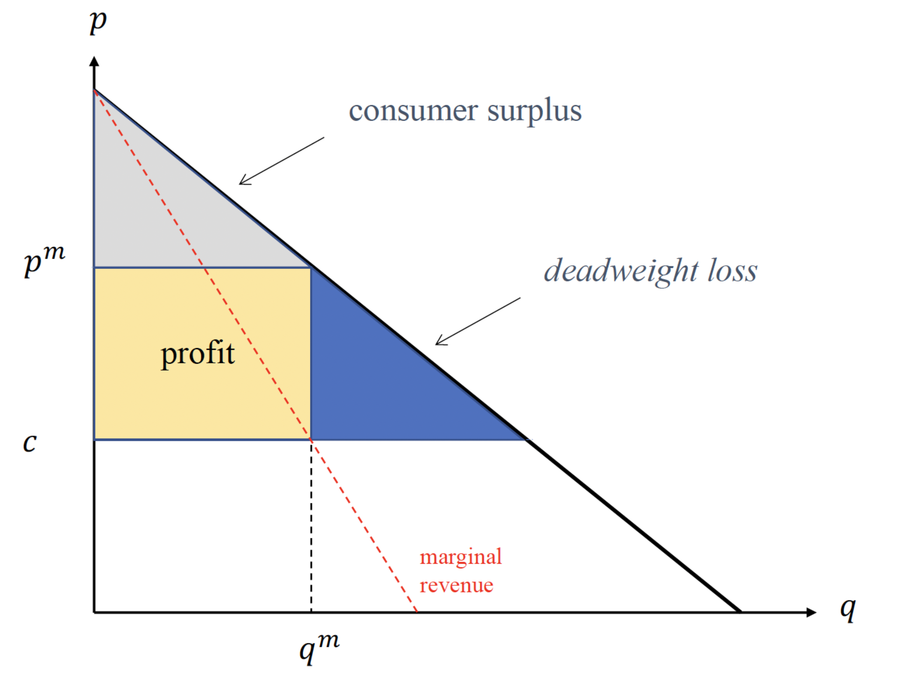

+++
author = "Laychiva Chhout"
title = "Monopoly"
date = "2023-12-20"
description = "Understand Monopoly and its caracteristic."
math = "true"
tags = [
    "economics",
]
categories = [
    "Economics",
]
series = ["Themes Guide"]
aliases = ["migrate-from-jekyl"]
image = "cover.png"
+++

## 1. Introduction 

Monopolies are a common topic of discussion in economics and business, but what exactly are they, and why do they exist? In this article, we'll explore the definition of a monopoly and the various sources that give rise to these dominant players in the market. We'll also shed light on the concept of economies of scale and scope and how they contribute to the formation of monopolies. To make things relatable, think of a monopoly as a company that rules the market, and we'll break down the reasons behind their existence.

### 1.1. Definition of a Monopoly

A monopoly is a situation in which a single company or firm dominates almost the entire market for a particular product or service. These firms have no significant competitors and often control between 50% and 100% of their market. Monopolies can be found in various industries, including network industries like electricity and telecommunications, as well as transportation and water supply companies.

### 1.2. Why Do Monopolies Exist?

1. **Natural Monopoly**

One of the primary reasons for the existence of monopolies is the concept of a natural monopoly. This occurs when it is economically more efficient for one firm to produce a good or service rather than multiple firms. High entry costs, economies of scale, and economies of scope all contribute to this phenomenon.

- **Economies of Scale:** 

    Economies of scale are cost advantages that a company gains as it produces more of a product. Imagine building a factory: the cost of building it stays the same whether you produce one unit or a thousand. By producing more, you can spread these fixed costs over a larger number of units, reducing the cost per unit.

- **Economies of Scope:** 

    Economies of scope come into play when a company produces a variety of related products. By doing so, they can share resources like marketing and distribution channels across different product lines. This not only saves costs but also allows them to learn from their experiences in one product line and apply those lessons to others.

2. **Entry Barriers**

Another reason for monopolies is the presence of entry barriers. These barriers can be due to high costs associated with entering an industry or the existence of essential facilities required for production. In some cases, existing firms may actively create strategic barriers to prevent new competitors from entering the market.

3. **Legal Restrictions to Entry**

Monopolies can also be supported by legal restrictions, such as exclusive licensing agreements, patents, or public service concessions. These legal protections grant a firm exclusive rights to provide a particular product or service, limiting competition.

### 1.3. Single-product monopoly

Suppose a market has been defined in which there is only **one firm** (monopoly). This firm produces **only one product or service** (single-product).
- The demand function is $q=D(p)$, where $q$ is a quantity and $p$ is a price; demand decrease with price:$$\frac{d D(p)}{d p}<0$$
- The inverse demand is denoted by $P(q)$.
- The production cost for $q$ units of product is denoted by $C(q)$, and we assume that $C'(q)\geq 0$, **the most units we produce the more cost we have to spent.**
- The monopoly sets the price that maximize its profit:
$$
\max_p \{p D(p)-C(D(p))\}
$$
- The first order condition (FOC) is given by $MR-MC = 0$ or:
$$
D(p)+p D^{\prime}(p)-C^{\prime}(D(p)) D^{\prime}(p)=0
$$
or also
$$
p-C^{\prime}(D(p))=-\frac{D(p)}{D^{\prime}(p)}
$$
- We introduce the **price elasticity of demand:**
$$
\varepsilon=-\frac{\partial D}{\partial p} \frac{p}{D}
$$

### 1.4. Price elasticity of demand

The concept of price elasticity of demand $(\varepsilon)$ is crucial in understanding how changes in price affect the quantity demanded for a product or service. Let's delve into this concept with the provided definition and examples:

**Definition**: Price Elasticity of Demand $(\varepsilon)$

The price elasticity of demand measures how sensitive the demand for a product is to changes in its price. Formally, it is calculated using the following equation:
$$
\varepsilon=-\frac{\partial D}{\partial p} \frac{p}{D}
$$

Here, $\varepsilon$ represents the price elasticity of demand, $\partial \mathrm{D} / \partial \mathrm{p}$ is the rate of change of demand with respect to price, and $p$ is the price of the product. Since the demand is typically decreasing as prices rise, the price elasticity is a positive number.

**Idea: Interpretation of Price Elasticity**

The idea behind price elasticity is to quantify how much the quantity demanded changes in response to a percentage change in price. In other words, it tells us the percentage change in demand for a product when the price changes by a certain percentage. This concept is best understood through examples:

1. Water Prices in Various Locations:

- In California, when the price of water decreases by $1\\% $, the demand for water increases by $0.16 \\%$. This means that people in California are somewhat responsive to price changes, and they are more likely to buy more water when it becomes cheaper.
- In South Africa, a $1 \\%$ decrease in water price results in a $0.17 \\%$ increase in water demand.
- In Australia, a $1 \\%$ decrease in water price leads to a $0.21 \\%$ increase in water demand.
These examples show that the price elasticity of demand for water is relatively low, indicating that consumers are somewhat sensitive to changes in water prices but not highly responsive.

2. Electricity Demand: Residential vs. Professional Market:
- The demand for electricity in the residential market is more elastic compared to the demand for electricity in the professional market. This means that when the price of electricity increases, people are more likely to reduce their consumption at home because their demand is relatively sensitive to price changes.

3. Mobile Telephony in France:
- The demand for mobile telephony in France is highly elastic, with a price elasticity ranging from 3 to 5 . This means that a small decrease in the price of mobile telephony services can lead to a significant increase in the demand for these services. Consumers in France are highly responsive to price changes in the mobile telephony market.

### 1.5. The inverse elasticity rule

We use the price-elasticity of demand to express the profit-maximizing price:

We obtain the inverse elasticity rule:
$$
\frac{p-C^{\prime}(D(p))}{p}=\frac{1}{\varepsilon}
$$
The monopoly produces on the elastic part of the demand curve (where $\epsilon > 1$ ), Why?

**Answer:**

A monopoly produces on the elastic part of the demand curve because it maximizes profits. The elastic part of the demand curve is where the quantity demanded of a good or service increases by a greater percentage than the price decreases. This means that the monopoly can earn more revenue by lowering its price and increasing its output.

To understand why this is the case, consider the following example. Suppose a monopoly produces a good with a price elasticity of demand of 2. This means that if the monopoly lowers its price by 1%, the quantity demanded of the good will increase by 2%.

If the monopoly is currently producing at a point where the price elasticity of demand is less than 1, it can increase its profits by lowering its price and increasing its output. This is because the increase in revenue from the increased output will be greater than the decrease in revenue from the lower price.

For example, suppose the monopoly is currently producing 100 units of the good at a price of $\\$10$ per unit. The total revenue for the monopoly is therefore $\\$1000$. If the monopoly lowers its price to $\\$9$ per unit, it will produce 120 units of the good. The total revenue for the monopoly will then be $\\$1080$. This is an increase in revenue of $\\$80$, even though the price has decreased by $\\$1$ per unit.

The monopoly will continue to lower its price and increase its output until it reaches a point where the price elasticity of demand is equal to 1. At this point, the monopoly is maximizing its total revenue. However, the monopoly will not go beyond this point, because any further decrease in price will lead to a decrease in total revenue.
In conclusion, a monopoly produces on the elastic part of the demand curve because it maximizes profits. The elastic part of the demand curve is where the quantity demanded of a good or service increases by a greater percentage than the price decreases.

### 1.7. The inverse elasticity rule and market power

**Market Power Definition:** Market power refers to a firm's ability to charge a price for its product that is higher than the cost of producing that product (marginal cost).

**Does a Monopoly Have Strong Market Power?**

**Yes**, a monopoly has substantial market power. Why? Here's a simple explanation:

A monopoly is the only supplier of a particular product or service in the market. This means it has no direct competitors, and consumers have no other options.
Because of this, a monopoly can set the price for its product without worrying about other companies undercutting them. They have the power to charge a higher price than what it costs them to make the product.
Now, let's connect this concept to the inverse elasticity rule:

$$
\frac{p-C^{\prime}(D(p))}{p}=\frac{1}{\varepsilon}
$$

**Inverse Elasticity Rule:** This rule tells us that the left-hand side of the equation, also known as the Lerner Index, is a measure of market power. In simple terms, it helps us gauge how much power a monopoly has in the market.

**Corollary (Additional Rule)**: The monopoly's market power is inversely related to the price elasticity of demand. This means that a monopoly has more market power when the demand for its product is less responsive to changes in price.

**Detail**: When we say a product's demand is "inelastic," it means that people don't change their buying habits much when the price changes. For a monopoly, having inelastic demand is a gold mine because they can raise prices significantly and still sell a lot of their product. In other words, consumers don't have many alternatives, so they'll pay the higher price.

## 2. Monopoly and market power

**Article 102 of the Treaty on the Functioning of the European Union:**
- A dominant position (we assume it is equivalent to a high market share) is not illegal per se
- What constitutes a breach of the Treaty is an abuse of dominant position (which is a reference to monopoly power)

**Explanation**: The Treaty on the Functioning of the European Union (TFEU) prohibits the abuse of a dominant position. This means that businesses with dominant positions in a market are not allowed to engage in conduct that harms competition and consumers.

What constitutes a breach of the TFEU is an abuse of dominant position depends on the specific facts of each case. However, some examples of abusive conduct include:
- Predatory pricing: Selling goods or services at a price below cost in order to drive competitors out of the market.
- Exclusive dealing agreements: Agreements between a business and its suppliers or customers that prevent them from doing business with competitors.
- Tying and bundling: Requiring customers to purchase one product or service in order to purchase another.
- Refusal to deal: Refusing to sell goods or services to competitors or to businesses that deal with competitors.

Defining a monopoly by "monopoly power" is more robust than defining it by "market share".
- Market definition problems: Apple operates as a monopoly on the Mac market.
- A firm with 80% market share could have more market power than a firm with 100% market share.
	- Explain: Even if a firm has 100% market share, it may not have much market power if the demand for its product or service is very elastic and there are low barriers to entry. For example, if a firm has 100% market share in the market for bottled water, it will not have much market power because the demand for bottled water is very elastic and there are low barriers to entry. New firms can easily enter the bottled water market and start competing with the existing firm. On the other hand, a firm with 80% market share may have more market power if the demand for its product or service is inelastic and there are high barriers to entry. For example, if a firm has 80% market share in the market for a patented drug, it may have a lot of market power because the demand for the drug is inelastic (people need the drug to stay alive) and there are high barriers to entry (it is difficult for new firms to develop and patent new drugs).

## 2. Comparative statics

Comparative statics in economics is like watching how things change at a party when you introduce a new factor. In this case, our party guests are economic variables, and the new factor is something from outside the party.

Now, let's see how this plays out in the world of monopolies and prices. Imagine you're in charge of a company that's the only player in town selling a special gadget. You want to know how the price you set for that gadget relates to how much it costs you to make one. 

Here's the scoop: If it costs you more to make each gadget as you make more of them, then your selling price goes up too (Tirole, 1988). It's like saying if baking more cookies in a day makes each cookie cost a bit more to bake, you'll sell them at a higher price to keep making a profit.

**Example:**
- If the demand is given by $D(p)=1-p$ and the cost of production is $C(q)=c q$

**Question:** What is the monopoly price $p^m(c)$ ?
- We maximize the profit $(p-c)(1-p)$ with respect to $p$, and we have $p^m(c)=$ $(1+c) / 2$, which is increasing in $c$

## 3. Multi-product monopoly

The first-order condition for good $i$ (1 or 2) is:
$$
\frac{p_i-C_i^{\prime}}{p_i}=\frac{1}{\varepsilon_{i i}}-\varepsilon_{i j} \frac{\left(p_j-C_j^{\prime}\right) D_j}{p_i D_i \varepsilon_{i i}}
$$
with
$$
\begin{gathered}
C_i^{\prime}=\frac{\partial C}{\partial q_i} \\
\varepsilon_{i i}=-\frac{\partial D_i}{\partial p_i} \frac{p_i}{D_i} \text { and } \varepsilon_{i j}=-\frac{\partial D_j}{\partial p_i} \frac{p_i}{D_j}
\end{gathered}
$$
- If $\varepsilon_{i j}=0$, the demands are independent: it is as if we had two independent single-product monopoly problems
- Otherwise, we have to adjust the inverse elasticity rule

### 3.1. Substitute goods

If goods 1 and 2 are **substitutes**, we have $\partial D_j / \partial p_i > 0$, which implies that
$$
\varepsilon_{i j}<0
$$
and thus we have
$$
\frac{p_i-C_i^{\prime}}{p_i}=\frac{1}{\varepsilon_{i i}}+\text { a positive term }
$$
The monopoly sets **higher** prices than two independent monopolies would 

$\rightarrow$ Why?

$\rightarrow$ The monopoly "internalizes" the negative externality (competition effet) resulting from the substitution between the two goods becuase: the monopoly knows that by setting a lower price, it can reduce the number of consumers who switch to buying the substitute good.

**Explanation:**
 - If goods 1 and 2 are substitutes, then an increase in the price of good 1 will lead to an increase in the demand for good 2. This is because consumers will switch to buying good 2 instead of good 1.
 - The cross-price elasticity of demand is a measure of the responsiveness of the demand for one good to a change in the price of another good. It is calculated as follows:
 - Cross-price elasticity of demand for good 2 with respect to good 1 = (Percentage change in the quantity of good 2 demanded) / (Percentage change in the price of good 1)
 - If goods 1 and 2 are substitutes, then the cross-price elasticity of demand for good 2 with respect to good 1 will be positive. This is because an increase in the price of good 1 will lead to an increase in the demand for good 2.
 - The symbol $\partial D_j / \partial p_i$ denotes the partial derivative of the demand for good 2 with respect to the price of good 1. It measures how much the demand for good 2 changes in response to a small change in the price of good 1, while holding all other factors constant.
 - If goods 1 and 2 are substitutes, then $\partial D_j / \partial p_i$ will be positive. This is because an increase in the price of good 1 will lead to an increase in the demand for good 2.

### 3.2. Complementary goods

If goods 1 and 2 are complements, we have $\partial D_j / \partial p_i<0$, which implies that
$$
\varepsilon_{i j}0
$$
and then
$$
\frac{p_i-C_i^{\prime}}{p_i}=\frac{1}{\varepsilon_{i i}}-\text { a positive term }
$$
The monopoly sets lower prices than two independent monopolies
$\rightarrow$ the monopoly "internalizes" the positive externality resulting from the complementarity between the two goods.

**Explanation:**
If goods 1 and 2 are complements, then a decrease in the price of good 1 will lead to an increase in the demand for good 2. This is because consumers are more likely to buy good 2 if the price of good 1 is lower.
A monopoly internalizes the positive externality resulting from the complementarity between the two goods. This means that the monopoly takes into account the fact that by lowering the price of its good, it is increasing the demand for the other good. This allows the monopoly to set a lower price and still make a profit. Two independent monopolies would not internalize this positive externality. Instead, each monopoly would focus on maximizing its own profit. This would lead to both monopolies setting higher prices than a single monopoly that internalizes the positive externality.

## 4. Inefficiency of a Monopoly:

Two main reasons for the **inefficiency of a monopoly:**
- Deadweight Loss: One of the main issues with a monopoly is the deadweight loss. This means there's a gap between what consumers would be willing to pay for a product and what they actually have to pay because the monopoly can charge higher prices. This gap represents a loss in overall economic welfare.
- Rent-Seeking: Monopolies can also lead to rent-seeking behavior. This happens when companies focus more on manipulating the market or lobbying for favorable regulations rather than on producing better products or services. It's like a race to win favors from policymakers rather than a race to improve.

But there are other arguments to say that a monopoly situation is efficient:
- Natural Monopoly: In some situations, a monopoly might actually be more efficient. Think of a "natural monopoly" like a public utility providing water or electricity. Building multiple competing systems for these services could be incredibly costly. It might make more sense for one company to handle it all, saving resources in the long run.
- Schumpeterian Argument: There's also the Schumpeterian argument. This suggests that big firms, like monopolies, might be better at innovation. They have the resources and incentive to invest in research and development, potentially bringing about new and better products or technologies.

### 4.1. Measuring Social Welfare

When trade occurs, economic agents derive some **"surplus"**.

**Surplus:**

- Consumer surplus: difference between consumers' willingness to pay and the price they actually paid
- Producer surplus: difference between producers' revenues and their production costs
- Total surplus: sum of consumer surplus and producer surplus.

- The intersection between $p^m$ and $q^m$ is the willingness to pay at monopoly price.
- Profit = $p^m \times q^m - c \times q^m$ 
- deadweight loss = willingess to pay at the production price but can't buy because the monopoly price is too high $\rightarrow$ profitable profit that can't be archived.
- Marginal revenue = optimal quantity to sell that avoid the deadweight loss.

**Deadweight loss: estimations**

Some economic studies have attempted to calculate the deadweight loss at the national level:
- Worcester (1973) for the US: between $0.4\\%$ and $0.7 \\%$ of GDP
- Cowling and Mueller (1978): between $4\\%$ and $13\\%$
- For France: Jenny and Weber (1983): $7.4\\%$

### 4.2. The real social cost of a monopoly

Posner (1975) argues that the deadweight loss, as we have defined it, underestimates the real social cost of a monopoly
$\rightarrow$ The prospect of monopoly profits could act as an incentive for firms (or any economic agent) to expend real resources to obtain a monopoly situation
$\rightarrow$ Idea of "rent seeking"
At the extreme, a firm might be willing to spend all of its future monopoly profits to become a monopoly.

## 5. Optimal regulation of a monopoly

Optimal regulation of a monopoly revolves around the principle of achieving allocative efficiency in a market, which occurs when every unit of production that yields a positive surplus is actually produced. This essentially means that for any additional unit of production, the consumer's willingness to pay should meet or exceed the marginal cost of producing that unit. The ideal scenario for resource allocation equates to pricing based on marginal cost.

Consider a simple scenario where the cost of production, $C(q)$, is represented as $F+c q$, with $c$ being the marginal cost and $F$ representing fixed costs. In this context, the efficient price, denoted as $p^{\star}$, should ideally be set at $c$, aligning with the marginal cost of production. However, setting the price at this level would result in the monopoly incurring a loss equivalent to its fixed costs, $\pi^{\star}=-F$, highlighting a budget balance issue and rendering optimal regulation unfeasible under these conditions.

One proposed solution to this dilemma is to provide the firm with a subsidy equal to $F$, the fixed costs, to offset the loss incurred at the efficient price. Nonetheless, this approach encounters several challenges. Subsidies might be legally prohibited, and acquiring the necessary funds through taxation introduces its own inefficiencies, potentially outweighing the benefits of correcting the initial inefficiency. Moreover, facilitating a budget transfer from the state to the monopoly raises concerns over "rent-seeking" behavior and the risk of "regulator capture", where the regulatory process is manipulated to benefit the regulated entity at the expense of the public interest. These complexities underscore the challenges in implementing optimal regulation within monopolistic markets, necessitating a careful consideration of the trade-offs involved.

### 5.1. Regulation with a budget balance constraint

In the context of regulating a monopoly under the constraint that the firm maintains a balanced budget, where its profits are non-negative ( $\pi \geq 0$ ), the approach to maximizing social welfare differs based on whether the monopoly offers a single product or multiple products.

For a single-product monopoly, the regulatory solution is relatively straightforward and involves average cost pricing. This method requires the monopolist to set its prices equal to the average total cost of production, ensuring that the firm earns a normal profit. This level of profit is sufficient for the monopoly to cover all its operational costs, including both fixed and variable expenses, thereby allowing it to sustain its business operations. The average total cost is determined by summing all the costs incurred by the monopolist and dividing by the total output. It's important to note that the average total cost generally exceeds the marginal cost of production, reflecting the full cost of producing each unit including the apportioned fixed costs.

When dealing with a multi-product monopoly, the regulatory strategy becomes significantly more complex due to the myriad of possible price and quantity combinations that can yield a non-zero profit for the firm. In this scenario, the optimal pricing strategy is known as **"Ramsey-Boiteux"** pricing. **Ramsey-Boiteux** pricing aims to identify a price structure that minimizes the welfare loss while ensuring the monopoly covers its fixed costs. The prices under this method are set in proportion to, but lower than, the inverse elasticity of demand for each product. This implies charging higher prices for products with less price-sensitive demand (inelastic services), as these products can bear a greater portion of the fixed costs without causing a substantial reduction in quantity demanded. Through this approach, **Ramsey-Boiteux** pricing seeks to distribute the burden of covering fixed costs in a manner that least distorts the market and maximizes social welfare.

### 5.2. Alternatives to regulation

The regulation of monopolies, while aimed at ensuring fair prices and preventing abuse of market power, comes with its own set of costs and challenges. These include information asymmetries between the regulator and the firm regarding costs and demand, the direct costs of maintaining a regulatory body (such as staffing and administrative expenses), and the risk of regulatory capture, where the regulatory agency may end up advancing the interests of the industry it is supposed to regulate rather than those of the public.

Given these drawbacks, there are alternative approaches to regulation that can also promote efficient market outcomes and safeguard consumer interests:

1. **Competition à la Demsetz** involves introducing competition through the bidding process for the right to serve a market. Under this approach, rather than regulating a single monopolist, potential service providers compete against each other to win an exclusive contract, usually by offering the lowest prices or the best service terms. This method leverages the competitive pressures of the market to ensure efficient pricing and service quality, reducing the need for direct regulatory oversight.
2. **Contestable Markets**[Theory of Baumol, Panzar and Willig (1982)] theory suggests that a market can be competitive even if it is served by only one firm, provided there are no significant barriers to entry or exit. If potential competitors can easily enter and exit the market, the threat of potential competition alone can discipline the incumbent firm to behave as if it were in a competitive market, thereby ensuring fair pricing and efficient service provision. This approach reduces the reliance on regulatory interventions by using market mechanisms to self-regulate.
3. **Intermodal Competition** refers to competition between different types of services that can satisfy the same need. For example, in telecommunications, traditional landline services might face competition from mobile telephony, VoIP, and other communication technologies. This type of competition can provide alternatives to consumers, limit the market power of any single provider, and drive innovation and efficiency in the market.

These alternatives to traditional regulation rely on market forces and competition to achieve desirable outcomes, such as lower prices, higher quality, and innovation, without the direct costs and potential inefficiencies associated with regulatory oversight. However, the effectiveness of these alternatives depends on the specific market conditions, including the presence of low barriers to entry and exit, the feasibility of competition in the market, and the potential for technological innovation to offer new alternatives.

<!-- # Price discrimination
---
**Definition of price discrimination**
The practice of charging different prices for the same good (or similar goods), the selling price depending on: the quantity purchased, the characteristics of the buyer, or other contract terms
**Examples:**
- Student price
- Airline fares ("yield management")
- Volume discounts ("2nd product offered")
- Vouchers ...

**Question:** How do we know if there is price discrimination?

## Test
---
There is price discrimination if difference in price between two versions of a good cannot be explained by a difference in cost
**Stigler test (1987):**
$$
\frac{p_1}{p_2} \neq \frac{c_1}{c_2}
$$
**Philips test (1983):**
$$
\left(p_1-c_1\right) \neq\left(p_2-c_2\right)
$$

## Conditions for price discrimination
---
Conditions for price discrimination:
1. Firms should have market power
2. Consumers should have different willingness to pay and firms should be able to identify them directly or indirectly (self-selection)
3. Resale opportunities should be limited

Resale (or arbitrage) is difficult:
- If the good is a service
- If the warranty applies only to the buyer
- If transaction costs are high (storage costs, search costs...)
- If there is a legal restriction on resale

## Pigou classification
---
Pigou (1920) identifies three forms of price discrimination:
- First degree discrimination (or personalized pricing)
- Third degree discrimination (or group pricing)
- Second degree discrimination (or versioning, or menu pricing). Includes volume discounts (and all forms of non-linear pricing)

These three forms of price discrimination require some level of information about consumers, in decreasing order (1st degree $3rd$ degree $2nd$ degree)

### First-degree price discrimination
---
**Definition (Tirole, 1988)**
The producer captures the entire consumer surplus

Examples of first-degree price discrimination? $\rightarrow$ Bazaar, fortune teller, Amazon experience (2000)
- In a bazaar, for example, sellers may negotiate with each customer individually to find the highest price that they are willing to pay for a particular item. This is a common practice in many developing countries, where markets are often less competitive and sellers have more bargaining power.
- Fortune tellers also often use first-degree price discrimination. They may charge customers different prices based on their perceived income, wealth, or willingness to pay. For example, a fortune teller may charge a wealthy customer more for a reading than they would charge a customer who appears to be less wealthy.
- Amazon Experience (2000) was a short-lived program that allowed Amazon customers to bid on prices for items. This is a textbook example of first-degree price discrimination, as Amazon was charging each customer the maximum price that they were willing to pay.
What is the deadweight loss? $\rightarrow$ No deadweight loss...
**Remark**: If a monopoly implements first-degree price discrimination, allocative efficiency is reached

An example of first-degree price discrimination
First-degree price discrimination is possible when consumers consume more than one unit of the good or service
Let's consider a monopoly telecommunication operator
- All consumers are identical
- The utility of making $q$ phone calls is $u(q)$
- The monopoly sets a two-part tariff $T(q)=f+p q$
- $f=$ subscription, $p=$ price per call (or minute)

What is the optimal price for the monopolist? How can it implement first-degree price discrimination?

1. First step: once a consumer has subscribed to the service, he chooses the number of calls $q$ he wants to make to maximize his net utility, $u(q)-p q$, and obtains the following utility from making this optimal number of calls:
$$
v(p)=\max _q\{u(q)-p q\}
$$
2. Second step: the monopolist anticipates the consumer's optimal number of calls. It sets the subscription price so that the utility of making calls is higher than the subscription price: $v(p) \geq f$
3. Third step: let's write $q(p)$ the demand for calls. The monopoly problem is:
$$
\underset{p, f}{\max \pi}=(p-c) q(p)+f
$$
under the constraint that
$$
f \leq v(p)
$$
Let's replace $f$ by $v(p)$ and differentiate wrt $p(\mathrm{CPO})$ :
$$
q(p)+(p-c) \frac{\partial q(p)}{\partial p}+\underbrace{\frac{\partial v(p)}{\partial p}}_{=-q(p)}=0
$$
we have therefore
$$
(p-c) \frac{\partial q(p)}{\partial p}=0
$$
such that
$$
p^*=c
$$
**Result**
 $$
\text { The optimal price is such that } p^*=c \text { and } f^*=v\left(p^*\right)
$$

Intuition:
- The monopoly sets a price for calls that maximizes consumer surplus
- And extracts all the surplus with the subscription price
Remark: all consumers pay the same price

### Third-degree price discrimination
---
**Definition**
Third-degree price discrimination occurs when the monopoly sets a different price for each of its customer segments and is able to identify which segment each of its customers belongs to.

Example
For example, suppose a monopoly operates in different geographical markets The monopoly sets its price in each market so that the marginal revenue is the same in all markets and equal to marginal cost:$$M R_1=M R_2=\cdots=m c$$
This can be written using the Lerner index:
$$\frac{p_i-m c}{p_i}=\frac{1}{\epsilon_i}$$
The price of the good is lower in the market where the demand is the most elastic

### Second-degree price discrimination
---
**Definition:** Second-degree price discrimination occurs when the monopoly sets a different price for each of its customer segments and is unable to identify which segment each of its customers belongs to

We also talk about discrimination by self-selection, versioning, or menu pricing.
Idea:
- The monopoly cannot identify the customers
- But it knows the distribution of customer types in the population
- The monopoly can define an offer to discriminate between the different types of customers
- How? What constraints should be taken into consideration? -->

****