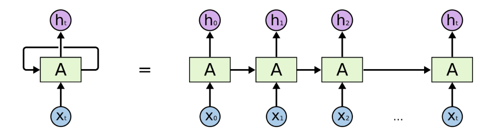
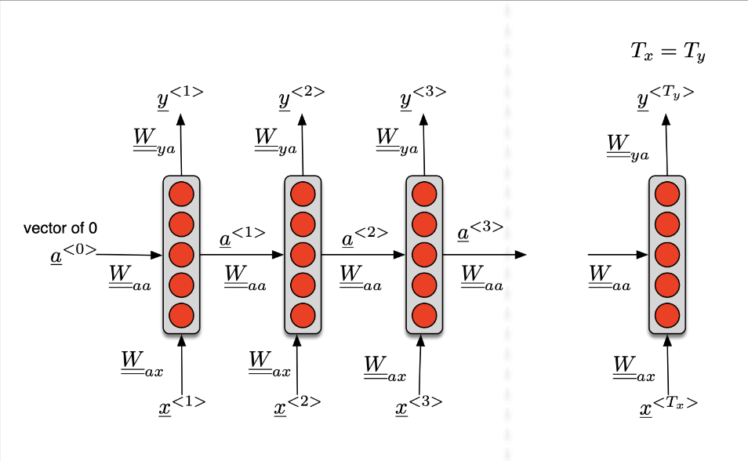
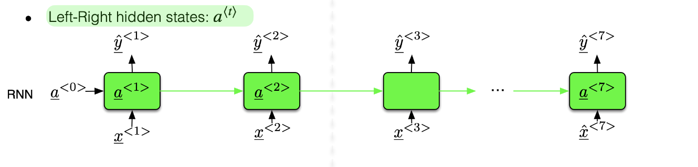
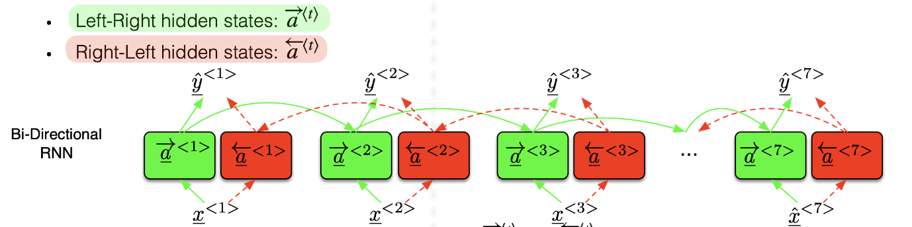
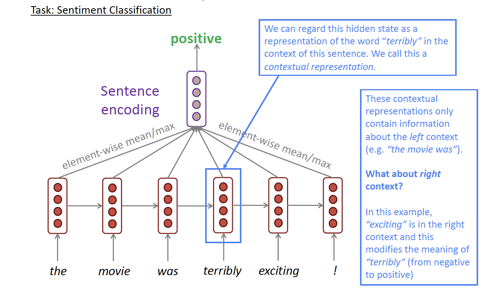
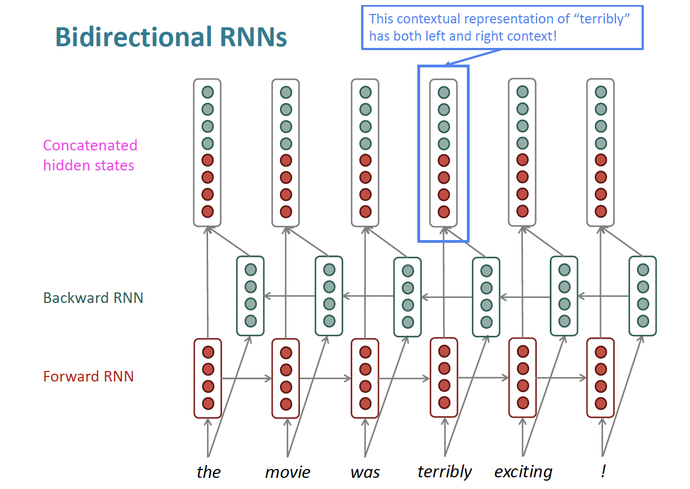
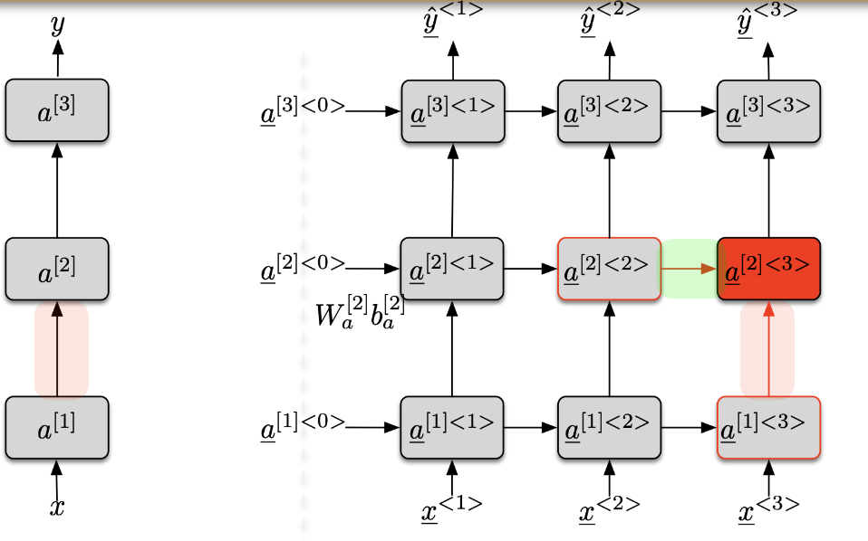
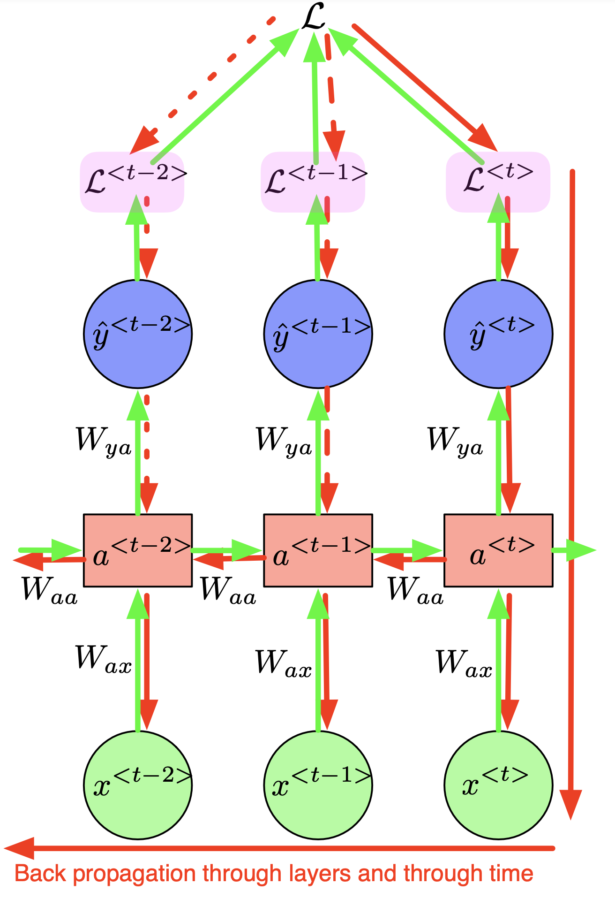
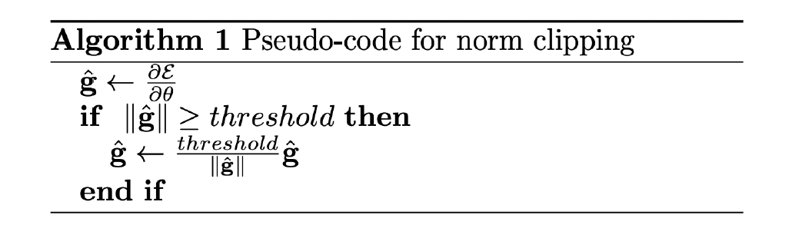
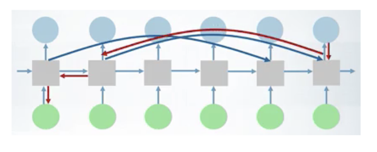

+++
author = "Laychiva Chhout"
title = "Recurrent Neural Networks"
date = "2023-12-27"
description = "Recurrent Neural Networks in detail."
math = "true"
tags = [
    "ai",
    "ml",
    "dl",
]
categories = [
    "Artificial Intelligence",
    "Deep Learning",
]
series = ["Themes Guide"]
aliases = ["migrate-from-jekyl"]
image = "pawel-czerwinski-8uZPynIu-rQ-unsplash.jpg"
+++

## 1. Introduction

When thinking of solving a problem, our brain always search for the information that we have experienced in the past and not solve a problem from scratch or without any information. You are reading this text and you are able to understand this text because of the previous words. The [Feed Forward Neural Network or Deep Feed Forward Neural Network](https://lchhout.github.io/blogs/post/mlp/) can not do this because the result of the network is given by only a hidden state and apply the activation function on it. Recurrent Neural Network is here to deal with this issue, it can deal with the sequential data and remember the all the previous steps to produce the result. In order to do so, RNN has it inner memory or we call it loops or folds. 

### 1.1. Notation

Inputs:

- $\mathbf{x}^{\langle t\rangle}$ : input vector $\mathbf{x}$ at time $t$ (of dimension $n^{[0]}$) 
- $\mathbf{x}^{\langle 1\rangle}, \mathbf{x}^{\langle 2\rangle}, \ldots, \mathbf{x}^{\left\langle T_x\right\rangle}$ : a sequence of inputs of length $T_x$ 

Outputs:
- $\mathbf{y}^{\langle t\rangle}$ : output vector $\mathbf{y}$ at time $t$ 

- $\mathbf{y}^{\langle 1\rangle}, \mathbf{y}^{\langle 2\rangle}, \ldots, \mathbf{y}^{\left\langle T_y\right\rangle}$ : a sequence of outputs of length $T_y$ 

$\boldsymbol{x}^{(i)\langle t\rangle}$ is the $\boldsymbol{i}^{t h}$ example in the training-set
- $T_x^{(i)}$ the length of the ${i}^{t h}$ input sequence
- $T_y^{(i)}$ the length of the $i^{\text {th }}$ output sequence

One thing to note here is that the length of the input and output sequence could be different, and this difference serves different purposes in various applications.

### 1.2 Type of RNN

| Input $\underline{x}$ | Output $\underline{y}$ | Type | Examples |
| :--- | :--- | :--- | :--- |
| sequence $T_x > 1$ | sequence $T_y = T_x$ | Many-To-Many | Named entity recognition |
| sequence $T_x > 1$ | single $T_y=1$ | Many-To-One | Sentiment analysis, Video activity detection |
| single $T_x=1$ | sequence, $T_y \neq 1$ | One-To-Many | Text generation, music generation |
| sequence $T_x > 1$                  | sequence $T_y > 1, T_y \neq T_x$     | Many-To-Many | Automatic Speech Recognition, Machine translation |

## 2. But what is the RNN?

**Question** 
Why not using a Multi-Layer-Perceptron?

**Answer:**
- We could indeed represent an input sequence $\mathbf{x}^{\langle 1\rangle}, \ldots, \mathbf{x}^{\left\langle T_x\right\rangle}$ as a large-vector of dimension $\left(n^{[0]} T_x\right)$
	- it would requires a huge input dimension!

**Problem 1**
- $T_x^{(i)}$ can be different for each $i$, 
- $\Rightarrow$ the dimension $\left(n^{[0]} \boldsymbol{T}_x^{(i)}\right)$ would be different for each $i$

**Problem 2**
- zero-padding ? $\left(n^{[0]} \max _i T_x^{(i)}\right)$
- it would still requires a huge input dimension!

**Problem 3**
- the network will have to learn different weights for the same dimension $n^{[0]}$ at various time $\langle t\rangle$ in the sequence $\Rightarrow$ no weight sharing !
- For exmaple, let's consider the sentence "Macron is a president of France." In this case, the neural network learns specific weights for the first position when processing "Macron," and it will have to adjust its weights again when processing "Currently Macron" at the second position. This lack of weight sharing allows the network to capture context-specific information at each time step.

**Solution** 
- Recurrent Neural Network that we will talk about in this post.
- 1D ConvNet (convolution only over time) that we will talk about in the next post.

## 2.1. First glance at RNN
Basically, a RNN is a neural network with a roll inside or loop inside. 

The RNN is simply the neural network but for each step $t0$, it takes the information from the previous step to generate a result at the current step. 

There are three different weight inside this RNN, 
- $\mathbf{W}_{a x}$ from $\mathbf{x}^{\langle t\rangle} \rightarrow \mathbf{a}^{\langle t\rangle}$,
- $\mathbf{W}_{a a}$ from $\mathbf{a}^{\langle t-1\rangle} \rightarrow \mathbf{a}^{\langle t\rangle}$,
- $\mathbf{W}_{y a}$ from $\mathbf{a}^{\langle t\rangle} \rightarrow \mathbf{y}^{\langle t\rangle}$

We can see those weights as below:

<!-- ![[../Photos/Screenshot 2023-10-04 at 20.41.36.png]] -->

We can see that $W_{aa}$ is actually the same across all the steps, it is a shared weight inside the loop. 

In an RNN, the hidden state $a^{\langle t \rangle}$ at time step $\langle t \rangle$ is computed based on the hidden state from the previous time step, $a^{\langle t - 1 \rangle}$, and the input at the current time step, $x^{\langle t \rangle}$, as well as certain weights and a bias term. The key point is that $a^{\langle t \rangle}$ is influenced by both the previous hidden state $a^{\langle t - 1 \rangle}$ and the current input $x^{\langle t \rangle}$.

- Compact notations
$$
\begin{aligned}
& \mathbf{a}^{\langle t\rangle}=g_1\left(\mathbf{W}_a\left[\mathbf{a}^{\langle t-1\rangle} ; \mathbf{x}^{\langle t\rangle}\right]+\mathbf{b}_a\right) \\\
& \hat{\mathbf{y}}^{\langle t\rangle}=g_2\left(\mathbf{W}_y \mathbf{a}^{\langle t\rangle}+\mathbf{b}_y\right) \\\
&
\end{aligned}
$$

## 2.2. Architecture of the RNN

### 2.2.1. Standard RNN

A standard RNN will read the input from the left to right. 
But what will the RNN do if we want to predict the first word of the sentence, the RNN has no context of the full sentence how can it generates the correct result? For example, 
- Question: is "Apple" a named entity?
	- "**Apple** stores sale the new **iPhone**."
	- "**Apple** juice is a refreshing and healthy **beverages**."

We can't predict since the standard RNN doesn't depend on the future. Then it comes the **Bi-directional RNN**.

### 2.2.2. Bi-directional RNN

This RNN simply reads the input from the left to right and from the right to left and the prediction is done from the concatenation of $\overrightarrow{a}^{\langle t\rangle}$ and $\overleftarrow{a}^{\langle t\rangle}$ which is given by the following formula:

$$\hat{y}^{\langle t\rangle}=g\left(W_y\left[\vec{a}^{\langle t\rangle}, \overleftarrow{a}^{\langle t\rangle}\right]+b_y\right)$$

Bi-directional RNN can be explained as below:

<!-- ![[../Photos/Screenshot 2023-10-12 at 11.54.46.png | center | 500]] -->

<!-- ![[../Photos/Screenshot 2023-10-12 at 11.55.34.png |center | 500]] -->

But Bi-directional RNN has some limitations:
- bi-directional RNNs are only applicable if you have access to the entire input sequence
- They are not applicable to Language Modeling, because in Language Modeling you only have left context available.
- If you do have entire input sequence (e.g., any kind of encoding), bi-directionality is powerful (you should use it by default).
- For example, BERT (Bidirectional Encoder Representations from Transformers) is a powerful pretrained contextual representation system built on bidirectionality.

### 2.2.3. Deep-RNN or Multi-Layer RNN or Stacked RNN

<!-- ![[../Photos/Screenshot 2023-10-04 at 20.54.49.png|center | 500]] -->

- For the layer [1], the inputs of the cell at time $\langle t\rangle$ are
	- the input at the current time $\langle t\rangle: x^{\langle t\rangle}=\mathbf{a}^{[0]\langle t\rangle}$
	- the value of the cell at the previous time $\langle t-1\rangle: \mathbf{a}^{[1]\langle t-1\rangle}$
- For the layer $[l]$, the inputs of the cell at time $\langle t\rangle$ are
	- the value of the cell of the previous layer $[l-1]$ at the current time $\langle t\rangle: \mathbf{a}^{[l-1]\langle t\rangle}$
	- the value of the cell of the current layer $[l]$ at the previous time $\langle t-1\rangle: \mathbf{a}^{[l]\langle t-1\rangle}$
	$$a^{[l]\langle t\rangle}=g\left(W_a^{[l]}\left[a^{[l]\langle t-1\rangle}, a^{[l-1]\langle t\rangle}\right]+b_a^{[l]}\right)$$

#### 2.2.3.1. Multi-Layer RNN in Practice 

- Multi-layer or stacked RNNs offer the ability to capture more intricate patterns and representations in sequential data, making them more effective than single-layer RNNs that encode information in high-dimensional vectors.
- In the context of stacked RNNs, the lower layers are responsible for capturing lower-level features or details in the input sequence, while the higher layers focus on extracting higher-level, more abstract features.
- High-performing RNNs often employ multiple layers, but they usually don't reach the same depth as convolutional or feed-forward networks. This balance between depth and complexity is essential for effectively modeling sequential data.
- For instance, in a 2017 study by Britz et al. titled "Massive Exploration of Neural Machine Translation Architectures," it was found that for tasks like Neural Machine Translation, using 2 to 4 layers in the encoder RNN and 4 layers in the decoder RNN tends to yield the best results. Frequently, having 2 layers outperforms a single layer, and occasionally, using 3 layers may provide slight improvements over 2.
- To train deeper RNNs, such as those with 8 layers, it's often necessary to incorporate skip-connections or dense-connections between layers to mitigate issues related to vanishing gradients and facilitate smoother training.
- In contrast, Transformer-based networks like BERT typically consist of more layers, often around 12 or 24, to effectively capture dependencies and relationships across a broader context in text data. This depth is one of the key factors contributing to their impressive performance in natural language understanding tasks.

#### 2.2.3.2. Forward Passes
<!--  -->

During the forward pass, 
- we compute $\mathbf{a}^{\langle t\rangle}, \hat{y}^{\langle t\rangle}, \mathscr{L}^{\langle t\rangle}, \mathscr{L}$
- Loss for time $\langle t\rangle: \mathscr{L}^{\langle t\rangle}\left(y^{\langle t\rangle}, \hat{y}^{\langle t\rangle}\right)$
	- $y^{\langle t\rangle}:$ ground-truth
	- $\hat{y}^{\langle t\rangle}:$ prediction
- Total loss
$$
\mathscr{L}=\sum_t \mathscr{L}^{\langle t\rangle}\left(y^{\langle t\rangle}, \hat{y}^{\langle t\rangle}\right)
$$
- Gradients ?
$\cdot$ compute $\frac{\partial \mathscr{L}}{\partial W_{y a}}, \frac{\partial \mathscr{L}}{\partial W_{a x}}, \frac{\partial \mathscr{L}}{\partial W_{a a}}, \frac{\partial \mathscr{L}}{\partial b_y}, \frac{\partial \mathscr{L}}{\partial b_a}$
- All weights are shared across time steps !!!

#### 2.2.3.3. Back Propagation Through Time (BPTT)

<!--  -->
<!-- ![[../Photos/Screenshot 2023-10-04 at 20.56.47.png  |center | 500]] -->

1. Backward: $\frac{\partial \mathscr{L}}{\partial W_{y a}}$
- Linearity
$$
\frac{\partial \mathscr{L}}{\partial W_{y a}}=\sum_{t=1}^T \frac{\partial \mathscr{L}^{\langle t\rangle}}{\partial W_{y a}}
$$
- How much varying $W_{y a}$ affect $\mathscr{L}^{\langle t\rangle}$ ? : chain rule
$$
\frac{\partial \mathscr{L}^{\langle t\rangle}}{\partial W_{y a}}=\frac{\partial \mathscr{L}^{\langle t\rangle}}{\partial \hat{y}^{\langle t\rangle}} \frac{\partial \hat{y}^{\langle t\rangle}}{\partial W_{y a}}
$$
- Very simple since $\hat{y}^{\langle t\rangle}$ depends on $W_{y a}$ on only place (indeed $a^{\langle t\rangle}$ does not depend on $W_{y a}$ )
$$
\hat{y}^{\langle t\rangle}=g_y\left(\mathbf{W}_{y a} \mathbf{a}^{\langle t\rangle}+\mathbf{b}_y\right)
$$

*No problem at all in this computation!*

2. Backward: $\frac{\partial \mathscr{L}}{\partial W_{aa}}$
- Linearity
$$
\frac{\partial \mathscr{L}}{\partial W_{a a}}=\sum_{t=1}^T \frac{\partial \mathscr{L}^{\langle t\rangle}}{\partial W_{a a}}
$$
- How much varying $W_{a a}$ affect $\mathscr{L}^{\langle t\rangle}$ ? no chain rule
$$
\frac{\partial \mathscr{L}^{\langle t\rangle}}{\partial W_{a a}} \neq \frac{\partial \mathscr{L}^{\langle t\rangle}}{\partial \hat{y}^{\langle t\rangle}} \frac{\partial \hat{y}^{\langle t\rangle}}{\partial a^{\langle t\rangle}} \frac{\partial a^{\langle t\rangle}}{\partial W_{a a}}
$$
	- because $a^{\langle t\rangle}$ also depends on $W_{a a}$ through $a^{\langle t-1\rangle}$ which itself depends on ...

- We use a formula of total derivative
$$
\begin{aligned}
\frac{\partial \mathscr{L}^{\langle t\rangle}}{\partial W_{a a}}=\frac{\partial \mathscr{L}^{\langle t\rangle}}{\partial \hat{y}^{\langle t\rangle}} \frac{\partial \hat{y}^{\langle t\rangle}}{\partial a^{\langle t\rangle}} & \left(\frac{\partial a^{\langle t\rangle}}{\partial W_{a a}}+\frac{\partial a^{\langle t\rangle}}{\partial a^{\langle t-1\rangle}} \frac{\partial a^{\langle t-1\rangle}}{\partial W_{a a}}+\cdots+\frac{\partial a^{\langle t\rangle}}{\partial a^{\langle t-1\rangle}} \cdots \frac{\partial a^{\langle 0\rangle}}{\partial W_{a a}}\right) \\\
& \sum_{k=0}^t \frac{\partial a^{\langle t\rangle}}{\partial a^{\langle t-1\rangle}} \cdots \frac{\partial a^{\langle k+1\rangle}}{\partial a^{\langle k\rangle}} \frac{\partial a^{\langle k\rangle}}{\partial W_{a a}} \\\
& \sum_{k=0}^t\left(\prod_{i=k+1}^t \frac{\partial a^{\langle i\rangle}}{\partial a^{\langle i-1\rangle}}\right) \frac{\partial a^{\langle k\rangle}}{\partial W_{a a}}
\end{aligned}
$$

3. Backward: $\frac{\partial \mathscr{L}}{\partial W_{ax}}$

Similar to the backward of $\frac{\partial \mathscr{L}}{\partial W_{aa}}$, because $a^{\langle t\rangle}$ also depends on $W_{a x}$ through $a^{\langle t-1\rangle}$ which itself depends on ...

We can clearly see the problem here during the back-propagation through time of a RNN which is the **vanishing** and **exploding** gradients. 
Observing the formula:
$$
\begin{aligned}
\frac{\partial \mathscr{L}^{\langle t\rangle}}{\partial W_{a a}}=
& \sum_{k=0}^t\left(\prod_{i=k+1}^t \frac{\partial a^{\langle i\rangle}}{\partial a^{\langle i-1\rangle}}\right) \frac{\partial a^{\langle k\rangle}}{\partial W_{a a}}
\end{aligned}
$$
- Suppose only one hidden units, then $a^{\langle t\rangle}$ is a scalar and consequently $\frac{\partial a^{\langle t\rangle}}{\partial a^{\langle t-1\rangle}}$ is also a scalar
	- if $\left|\frac{\partial a^{\langle t\rangle}}{\partial a^{\langle t-1\rangle}}\right|<1$, then the product goes to $\mathbf{0}$ exponentially fast
	- if $\left|\frac{\partial a^{\langle t\rangle}}{\partial a^{\langle t-1\rangle}}\right| > 11$, then the product goes to $\infty$ exponentially fast
- Vanishing gradients: $\left|\frac{\partial a^{\langle t\rangle}}{\partial a^{\langle t-1\rangle}}\right|<1$
	- contributions from faraway steps vanish and don't affect the training
	- difficult to learn long-range dependencies
- Exploding gradients: $\left|\frac{\partial a^{\langle t\rangle}}{\partial a^{\langle t-1\rangle}}\right| > 1$
	- make the learning process unstable
	- gradient could even become $\mathbf{N a N}$

Another source that clearly explains this phenomenon: [slides 47-55](https://web.stanford.edu/class/cs224n/slides/cs224n-2023-lecture05-rnnlm.pdf)
#### 2.2.3.4. How to deal with exploding gradient?
1. **Gradient clipping**
	gradient $d \theta=\frac{\partial \mathscr{L}}{\partial \theta}$ where $\theta$ are all the parameters
	- if $\|\theta\|$ > threshold
$$
d \theta \leftarrow \frac{\text { threshold }}{\|\theta\|} d \theta
$$
	- clipping doesn't change the direction of the gradient but change its length
	- we can clip only the norm of the part which causes the problem
	- we choose the threshold manually: start with a large threshold and then reduce it.

<!-- ![[../Photos/Screenshot 2023-10-12 at 12.07.44.png|center | 300]] -->

2. **Truncated BPTT**
- Training very long sequences
	- time consuming!
	- exploding gradients!
- Truncated BPTT:
	- run forward and backward passes through the chunks of the sequence (instead of the whole sequence)
- Forward
	- We carry hidden states forward in time forever
- Backward
	- only back-propagate in the chunks (small number of steps)
- Much faster but **dependencies longer than the chunk size don't affect the training** (at least they still work at Forward pass) (Training is useless in that case). 

#### 2.2.3.5. How to deal with vanishing gradient?
In RNN, at each step, we multiply the Jacobian matrix which leads to vanishing gradient if we have a long dependencies.

**Solution**: add a short-cuts between hidden states that are separated by more than one step.

- Back-propagation through the shortcuts: the gradients vanish slower
	- we can learn long-term dependencies

**Another solution** to tackle the vanishing gradient problem is by using special architectures like LSTM or GRU, which handle past data efficiently. We'll explore these in our upcoming blog post.

## Reference 

- Lecture slides of Professor: **Geoffroy Peeter, Télécom Paris.**
- Lecture slides of stanford university: https://web.stanford.edu/class/cs224n/slides/