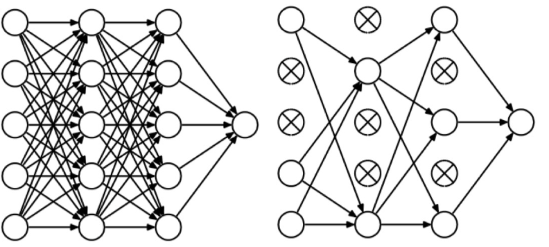

+++
author = "Laychiva Chhout"
title = "Regularization"
date = "2023-12-24"
description = "Regularization in detail"
math = "true"
tags = [
    "ai",
    "ml",
    "dl",
]
categories = [
    "Artificial Intelligence",
    "Deep Learning",
    "Machine Learning"
]
series = ["Themes Guide"]
aliases = ["migrate-from-jekyl"]
image = "reg_photo.png"
+++

## 1. Regularization

Regularization is a technique used to prevent overfitting in models. Overfitting occurs when a model learns the noise and fluctuations in the training data to the extent that it negatively impacts the performance of the model on new data. There are several type of regularization that we will go through in this blog post. 

**Idea**: Heavy weights can imply overfitting. This is because heavy weights indicate that the model is relying heavily on a small number of features to make predictions. If these features are not representative of the data that the model will be used on in production, then the model is likely to overfit, so to solve this problem we have to make a constraint on the weight to make it as small as possible.

### 1.1. L1 and L2 regularization

**Goal of L1 and L2 Regularization**: the primary goal of both L1 and L2 regularization is to reduce overfitting in a model. This is achieved by adding a penalty to the loss function, which helps to control the complexity of the model.

**Mechanism**
- Regularization in Logistic Regression:
    
    The cost function in logistic regression with L1 and L2 regularization is given by:
$$
J(\mathbf{w}, b)=\frac{1}{m} \sum_{i=1}^m \mathscr{L}\left(\hat{y}^{(i)}, y^{(i)}\right)+\frac{\lambda_1}{2 m}\|\mathbf{w}\|_1+\frac{\lambda_2}{2 m}\|\mathbf{w}\|_2^2
$$
- Here, $\mathscr{L}$ is the loss for a single training example, $m$ is the number of training examples, $\mathbf{w}$ is the weight vector, and $b$ is the bias.
- the second term represents the $\mathrm{L}1$ norm of $\mathbf{w}$, which is the sum of the absolute values of the weights: $\sum_{j=1}^{n_x}|w_j|$.
- the third term represents the $\mathrm{L} 2$ norm squared of $\mathbf{w}$, which is the sum of the squares of the weights: $\sum_{j=1}^{n_x} w_j^2$.

#### 1.1.1 L1 Regularization (Lasso):
Also known as Lasso regularization, adds a penalty term to the loss function that is proportional to the absolute value of the model parameters. This penalty term encourages the model to select a smaller subset of features that are important for making predictions. In other words, L1 regularization can be used for feature selection. The absolute value penalty function in L1 regularization encourages the model to shrink the weights towards zero. This is because the penalty is proportional to the absolute value of the weight, so the model can minimize the penalty by making the weight zero. When the model shrinks the weights towards zero, some of the weights will eventually become zero. This results in a sparse weight vector, where many of the weights are zero.

**Recaps:**
- L1 regularization adds the L1 norm of the weights to the loss function.
- This tends to result in a sparse weight vector (w) with many weights being zero.
- It's particularly useful when we suspect that many features are irrelevant or redundant.

#### 1.1.2. L2 Regularization (Ridge):
also known as Ridge regularization, adds a penalty term to the loss function that is proportional to the square of the model parameters. This penalty term encourages the model to distribute the weights evenly across all of the features. By doing so, L2 regularization can prevent the model from becoming too dependent on any one feature. The square penalty function in L2 regularization encourages the model to shrink the weights towards zero, but not as much as L1 regularization. This is because the penalty is proportional to the square of the weight, so the model can minimize the penalty by making the weights small, but not necessarily zero. When the model shrinks the weights towards zero, the magnitude of all of the weights will be reduced. However, the weights will not necessarily become zero. This results in a weight vector where all of the weights are small, but not necessarily zero.

**Recaps**
- L2 regularization adds the $L 2$ norm squared of the weights to the loss function.
- This typically leads to smaller values for all weights in the vector $\mathbf{w}$, but not necessarily zero.
- It's useful for handling multicollinearity and model complexity without necessarily eliminating features.

#### 1.1.3. L1 + L2 Regularization (Elastic Net):
combines the advantages of L1 and L2 regularization. It can produce sparse weight vectors, like L1 regularization, and it can prevent overfitting, like L2 regularization.

#### 1.1.4. Regularization Parameter $(\lambda)$ :
- $\lambda$ is the regularization parameter, a hyperparameter that controls the strength of the regularization.
- It needs to be tuned using techniques like cross-validation.


### 1.2. DropOut regularization

Dropout regularization is a technique that can be used to reduce the risk of overfitting. It works by randomly dropping out neurons from the network during training. This forces the model to learn to rely on a wider range of features, which can help to improve the generalization performance of the model.



**Dropout Mechanism During Training**
- Random Deactivation of Neurons:
    - During the training process, for each training example, a certain proportion of the neurons in the network are randomly turned off. This is done with a probability $p$, often set to 0.5 .
    - Turning off a neuron means it does not participate in the forward and backward passes during that specific training phase; effectively, it's as if those neurons and their connections temporarily do not exist.
- Varying Dropout Rates:
    - The probability $p$ can be varied across different layers. Typically, a higher $p$ is used for larger layers (with more units), and a lower $p$ for smaller layers.
- Impact on Different Training Examples:
    - For different training examples, different sets of neurons are turned off, which means the network sees a slightly different version of itself with each training sample $\rightarrow$ generalized the data!

**Dropout During Testing**
- No Dropout Applied:
    - During the testing phase, dropout is not used. All neurons are active, and the network operates in its full capacity.
  
**Effects and Benefits of Dropout**
- Prevents Co-adaptation:
    - Dropout prevents co-adaptation between units by ensuring that they do not become overly reliant on the presence of particular neurons in the network.
- Model Averaging:
    - Dropout can be seen as a way of averaging different neural network architectures that share the same parameters, enhancing the generalization capability of the model.
- Acts as Regularization:
    - The random deactivation of neurons acts as a form of regularization, making the network simpler and easier to train.
- Forces Distribution of Weights:
    - Since the network cannot rely on any specific feature too heavily, it is forced to spread out its weights, reducing the reliance on any particular input feature.
- Similar to L2 Regularization:
    - It has been shown that dropout has an effect similar to shrinking the squared norm of the weights, akin to L2 regularization. However, dropout is an adaptive form of regularization, affecting more complex units (with more weights) more heavily than simpler ones.

### 1.3. Data Augmentation as Regularization

Data augmentation can be viewed as a form of regularization in machine learning, particularly in the context of training deep neural networks.

**Goal:** The primary goal of data augmentation as a form of regularization is to prevent overfitting by artificially increasing the diversity and size of the training dataset. This is achieved by introducing variations in the data, which helps the model learn more generalizable patterns.

**Mechanism:**
- In image processing, for example, data augmentation may include transformations like rotations, translations, scaling, flipping, altering brightness or contrast, and more. For textual data, it might involve techniques like synonym replacement, sentence shuffling, or translation into another language and back.
- These transformations create variations of the existing data, exposing the model to a broader range of input scenarios, thereby preventing it from learning and relying too heavily on specific patterns present in the original training set.

**Effect on Model Training:**
- By training on this augmented dataset, a model is less likely to overfit to the noise and specific details of the training set. Instead, it learns more robust and generalizable features.
- This is particularly important in deep learning models, which have a large number of parameters and are therefore more prone to overfitting.

**Comparison with Traditional Regularization:**
- Traditional regularization techniques like L1 and L2 regularization work by directly modifying the learning process or the model architecture. Data augmentation, on the other hand, indirectly regularizes the model by enhancing the training data itself.
- Unlike L1 and L2 regularization that add penalty terms to the loss function, data augmentation achieves regularization by enriching the input space.


### 1.4. Early Stopping as Regularization

Early stopping is a form of regularization used to prevent overfitting in machine learning models, especially in the context of training deep neural networks.

**Goal:**
- The main objective of early stopping is to halt the training process before the model becomes overly fitted to the training data. It strikes a balance between underfitting and overfitting by stopping training at the point where performance on a validation set is maximized.

**Mechanism:**
- During training, the model's performance is continuously monitored on a separate validation set that is not used for training.
- If the performance on the validation set begins to degrade (e.g., the validation error starts to increase), it's an indication that the model is beginning to overfit the training data.
- Early stopping intervenes by halting the training process at this point, effectively "freezing" the model at its state of optimal generalization.

**Effect on Model Training:**
- Early stopping prevents the model from learning the noise and specific patterns in the training set that do not generalize to new data.
- It can be particularly beneficial for deep learning models, which are prone to overfitting due to their complexity and large number of parameters.

**Comparison with Traditional Regularization:**
- Unlike methods like L1 and L2 regularization, which add penalty terms to the loss function to constrain the model complexity, early stopping regulates the training process itself.
- It doesn't alter the model or its objective function but controls the duration of the training.

**Code snipped on how early stopping work**

```python 
from keras.models import Sequential
from keras.layers import Dense
from keras.callbacks import EarlyStopping
from keras.datasets import mnist
from keras.utils import np_utils

# Load dataset
(x_train, y_train), (x_test, y_test) = mnist.load_data()

# Preprocess data
x_train = x_train.reshape(x_train.shape[0], -1) / 255.0
x_test = x_test.reshape(x_test.shape[0], -1) / 255.0
y_train = np_utils.to_categorical(y_train)
y_test = np_utils.to_categorical(y_test)

# Build the model
model = Sequential()
model.add(Dense(512, input_shape=(784,), activation='relu'))
model.add(Dense(10, activation='softmax'))

# Compile the model
model.compile(loss='categorical_crossentropy', optimizer='adam', metrics=['accuracy'])

# Define early stopping callback
# If 5 steps after the minimun value is reach,
# and there is no improvement, we stop the training process
early_stopping = EarlyStopping(monitor='val_loss', patience=5, verbose=1, mode='min')

# Train the model with early stopping callback
model.fit(x_train, y_train, validation_data=(x_test, y_test), epochs=50, batch_size=256, callbacks=[early_stopping])

```

  

  

## Reference 

Lecture slides of Professor: **Geoffroy Peeter**, **Télécom Paris.**


  

  