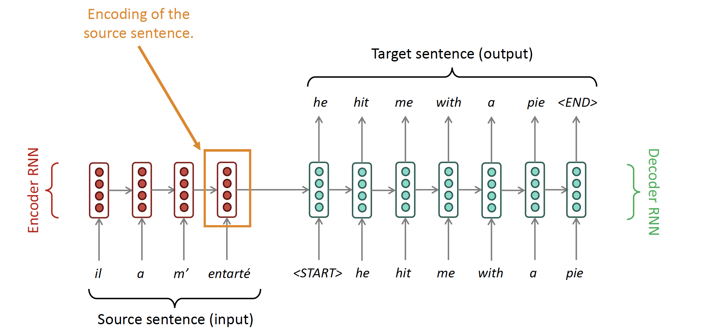
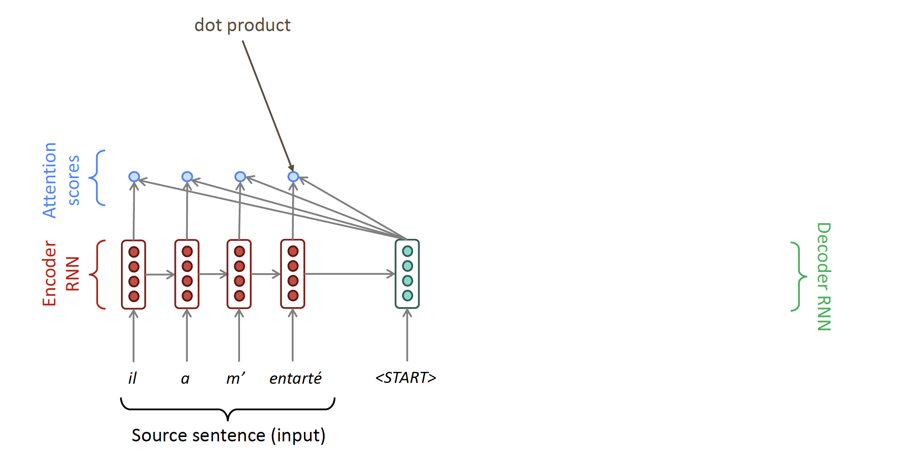
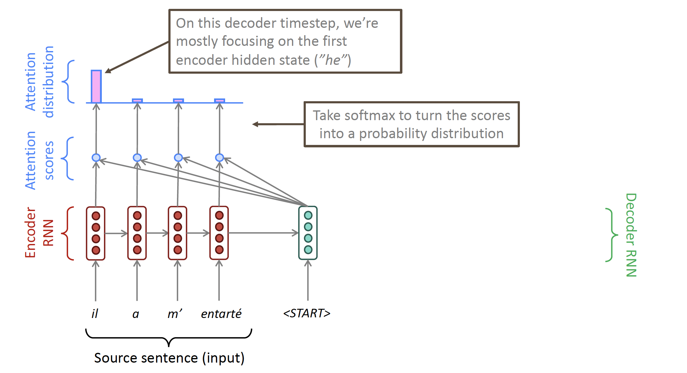
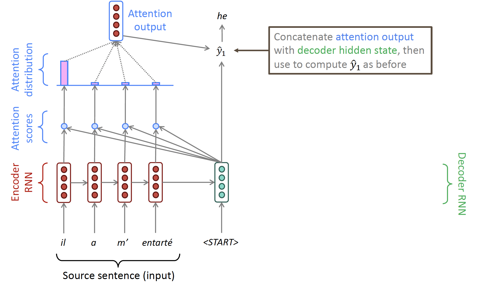

+++
author = "Laychiva Chhout"
title = "Attention!"
date = "2023-12-28"
description = "From seq2seq to attention models."
math = "true"
tags = [
    "ai",
    "dl",
]
categories = [
    "Artificial Intelligence",
    "Deep Learning",
]
series = ["Themes Guide"]
aliases = ["migrate-from-jekyl"]
image = "cover.png"
+++

## 1. Introduction

In the previous blog post about the [seq2seq model](https://lchhout.github.io/blogs/post/seq2seq/), we observed a significant bottleneck within the seq2seq architecture: the necessity to retain all information from the source input in order to create a context vector. However, in reality, we don't actually need to remember everything; instead, we can focus on specific segments within the source input.

To put it another way, the context vector in seq2seq remains constant, meaning that regardless of the word being translated in machine translation, the same context vector is used. This differs from real-world scenarios where we only need to consider specific segments or parts of the input source.

## 2. Attention Models

We have seen the architecture of a seq2seq or encoder-decoder model:

**Question**: What is the problem with this architecture?

- Encoding of the source sentence. This needs to capture all information about the source sentence. Information bottleneck!

**Solution**: Attention architecture provides solution to this bottleneck problem!

**Core Idea:** On each step of the decoder, use direct connection to the encoder to focus on a **particular part** of the source sequence.

So basically, at each time step on the decoder side, it will calculate the attention score for all elements in the source input. This attention score will be used to create an attention distribution (indicating the probability of using the context(hidden state) of a specific element).

The attention outcome comes from the weighted sum of all the hidden states, and contains mainly information from the hidden states that have received the most attention.

<!-- ![[../Photos/Screenshot 2023-10-12 at 12.21.00.png]]
![[../Photos/Screenshot 2023-10-12 at 12.21.47.png]]
![[../Photos/Screenshot 2023-10-12 at 12.21.57.png]] -->

## 2.1. Attention in Equation

**Input:** 

- we have encoder hidden states $h_1, \ldots, h_N \in \mathbb{R}^h$
- On timestep $t$, we have decoder hidden state $s_t \in \mathbb{R}^h$

**Output:**

- We calculate the attention scores $e^t$ for this step:
$$
\boldsymbol{e}^t=\left[\boldsymbol{s}_t^T \boldsymbol{h}_1, \ldots, \boldsymbol{s}_t^T \boldsymbol{h}_N\right] \in \mathbb{R}^N
$$
- We take softmax to get the attention distribution $\alpha^t$ for this step (this is a probability distribution and sums to 1)

$$ \alpha^t = \operatorname{softmax}\left(\boldsymbol{e}^t\right) \in \mathbb{R}^N
$$

- We use $\alpha^t$ to take a weighted sum of the encoder hidden states to get the attention output $\boldsymbol{a}_t$

- Finally we concatenate the attention output $\boldsymbol{a}_t$ with the decoder hidden state $s_t$ and proceed as in the non-attention seq2seq model
$$
\left[\boldsymbol{a}_t ; \boldsymbol{s}_t\right] \in \mathbb{R}^{2 h}
$$

**Note** A few notation and keyword we have to take away:

- **query**: the RNN hidden state $s^{\langle\tau-1\rangle}$ of the output sequence (just before emitting $y^{\langle\tau\rangle}$)
- **keys**: the RNN hidden states $a^{\langle t\rangle}$ of the input sentence.

So here, the attention distribution is obtained by applying softmax to the attention scores, and these attention scores are derived from the multiplication (or another alignment function) of **query** and **keys**. 

This take away is important because it is a basic notion of the [self-attention](https://lchhout.github.io/blogs/selfattention/) model that we will go through in the upcoming blogpost. 

## Reference

- Lecture slides of Professor: **Geoffroy Peeter**, **Télécom Paris.**
- Lecture slides of stanford university: https://web.stanford.edu/class/cs224n/slides/

