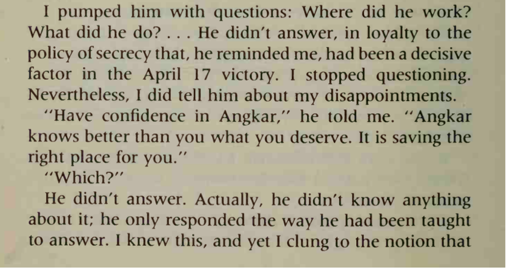
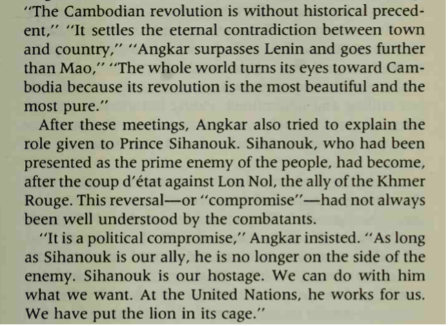
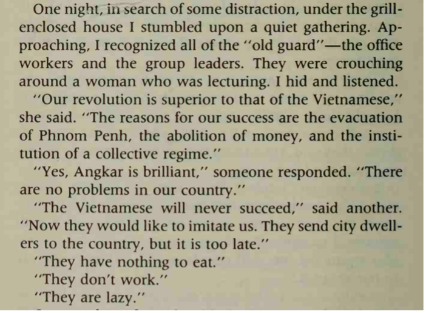
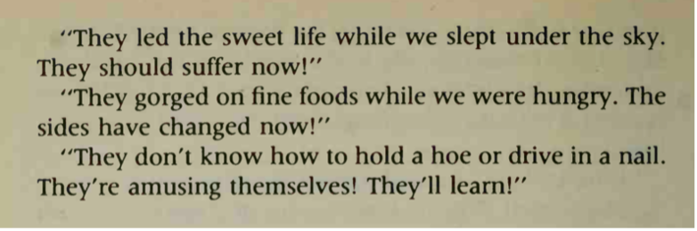

+++
author = "Laychiva Chhout"
title = "សៀវភៅ Au-delà du ciel"
date = "2024-04-12"
description = "ចំណាប់អារម្មណ៍ផ្ទាល់ខ្លួនលើសៀវភៅ Au-delà du ciel។"
math = "true"
tags = [
    "history"
]
categories = [
    "history"
]
series = ["Themes Guide"]
aliases = ["migrate-from-jekyl"]
image = "cover.jpg"
draft= "true"
+++

សៀវភៅ Au-dela du ciel គឺជាស្នាដៃនិពន្ធរបស់អ្នកស្រី Laurence Picq ដែលអ្នកស្រីបានរៀបរាប់ពីជីវិតរបស់អ្នកស្រីនៅក្នុងរបបកម្ពុជាប្រជាធិបតេយ្យ។ ការរៀបរាប់ទាំងអស់នេះ ខ្ញុំគិតថាជាភស្តុតាងដ៏សំខាន់មួយដែលយើងអាចប្រើប្រាស់ដើម្បីវិភាគលើរឿងរ៉ាវប្រវត្តិសាស្រ្តរបស់ប្រទេសកម្ពុជាយើង។
### ១ ប្រវត្តិរបស់អ្នកស្រី Laurence Picq
អ្នកស្រី Picq គឺជាជនជាតិបារាំងដែលបានរៀបការជាមួយបុរសជនជាតិខ្មែរម្នាក់ដែលមានឈ្មោះថា សួង ស៊ីខឿន នៅក្នុងឆ្នាំ ១៩៦៨។ បុរសម្នាក់នេះគឺជាកម្មាភិបាលខ្មែរក្រហមម្នាកដែលបម្រើការនៅក្បែរមេដឹកនាំខ្មែរក្រហមឈ្មោះ អៀង សារី។ នៅក្នុងឆ្នាំ ១៩៧០ នៅក្នុងកំឡុងពេលដែលមានរដ្ឋប្រហារលុននល់ ស៊ីខឿន និង មេដឹកនាំខ្មែរក្រហមផ្សេងទៀតបានបង្កើតនូវចលនាមួយនៅទីក្រុង ប៉េកាំងប្រទេសចិន ដែលនៅពេលនោះ អ្នកស្រី Picq ក៏បានចូលរួមនៅក្នុងចលនានោះដែរដោយអ្នកស្រីបានធ្វើដំណើរទៅតាមប្តីរបស់អ្នកស្រី។ នៅថ្ងៃ ១០ ខែ តុលា ឆ្នាំ១៩៧៥ អ្នកស្រីត្រូវបានអនុញ្ញាតិ្តឱ្យចូលមកក្នុងប្រទេសកម្ពុជា នៅពេលនោះហើយដែលអ្នកស្រីបានស្វែងយល និង រកឃើញនូវភាពពិតនៃរបបប្រល័យពូជសាសន៍មួយនេះ។ នៅពេលមកដល់ប្រទេសកម្ពុជា អ្នកស្រីត្រូវបានគេនាំទៅរស់នៅក្នុងអគារ B1 ដែលជាអក្សរកាត់តំណាងឱ្យក្រសួងការបរទេសដែលការងាររបស់អ្នកស្រីនៅពេលនោះគឺបកប្រែនូវអត្ថបទដែលត្រូវចាក់ផ្សាយតាមវិទ្យុជាតិជារៀងរាល់ថ្ងៃ ទៅជាភាសាបរទេសដើម្បីចាក់ផ្សាយទៅកាន់អន្តរជាតិ។ 
### 2 ការវិភាគ និងចំណាប់អារម្មណ៍ផ្ទាល់ខ្លួនខ្លះៗ
សៀវភៅនេះបានរៀបរាប់ពីជីវិតរស់នៅប្រចាំថ្ងៃរបស់អ្នកស្រី ដែលអ្នកស្រីបានរៀបរាប់យ៉ាងលំអិត និងភ្ជាប់មកជាមួយនូវភស្តុតាងប្រវិត្តិសាស្រ្តជាច្រើនដែលខ្ញុំគិតថាអាចធ្វើឱ្យយើងយល់ពីគោលនយោបាយ និងផ្នត់គំនិតរបស់កម្មាភិបាលសម័យនោះ។ ជាក់ស្តែងចំណុចសំខាន់ៗមួយចំនួនដែលមាននៅក្នុងសៀវភៅនេះមានដូចជា៖ 

 
មេដឹកនាំខ្មែរក្រហមសុទ្ធតែជាសិស្សដែលសិក្សានៅបរទេសតែ ពួកគេមិនបានប្រើប្រាស់ប្រាជ្ញានោះទេ ពោលគឺពួកគេបានជឿជាក់ទាំងស្រុងទៅលើមនោគមវិជ្ជារបស់អង្គការដោយលែងស្គាល់អ្វីត្រូវ និងអ្វីខុស។ 

ការលើកឡើងនេះធ្វើឡើងដោយសារតែមានការដេញប្រជាជនចេញពីទីប្រជុំជន និងការឈប់ប្រើប្រាស់លុយដែលអង្គការធ្វើឱ្យមានភាពស្មើគ្នារវាងមនុស្សគ្រប់គ្នាទាំងអស់នៅក្នុងប្រទេសកម្ពុជា ដែលអ្នកដឹកនាំសម័យនោះគិតថាអស្ចារ្យជាង Lenin និង Mao។  នៅក្នុងសម័យនោះ សម្តេចនរោតម្តសីហនុ ត្រូវបានខ្មែរក្រហមចាប់ទុកជាចំណាប់ខ្មាំង។

 
ការធ្វើបដិវដ្តនៅក្នុងសម័យនេះអ្នកដឹងនាំខ្មែរក្រហម តែងតែមានគំនិតចង់ឈ្នះ និងប្រឆាំងជាមួយវៀតណាម នេះជាហេតុមួយដែលនៅសម័យនោះតែងតែមានសង្គ្រាមរវាងកម្ពុជា និងវៀតណាម។ ដែលចុងក្រោយនៅឆ្នាំ ១៩៧៨ វៀតណាមបានវាយយកឈ្នះលើទ័ពខ្មែរក្រហម ហើយខ្មែរក្រហមបានរត់ទៅព្រំដែនកម្ពុជា-ថៃ។ 

 
ការនិយាយដោយកម្មាភិបាលខ្មែរក្រហមនេះ បានបង្ហាញឱ្យយើងឃើញថា ពួកគេមានគំនិតស្អប់ និងចង់សងសឹកប្រជាជនដែលរស់នៅក្នុងទីក្រុង ក៏ដូចជាអ្នកដែលមានធនធាននៅក្នុងសម័យលន់នល់ ដែលនេះក៏អាចជាហេតុផលមួយដែលធ្វើឱ្យមានការសម្លាប់អ្នកចេះដឹងនៅក្នុងសម័យនោះ មិនមែនដោយសារតែ អ្នកចេះដឹងជាសត្រូវរបស់បដិវដ្ដនោះទេ។ ហេតុផលមួយទៀតដែលធ្វើឱ្យមានការកាប់សម្លាប់នោះគឺ នៅសម័យនោះបើសិនជាអង្គការចោទថានរណាម្នាក់ក្បត់ នោះម្នាក់នោះនឹងត្រូវសម្លាប់ចោល រួមទាំងមនុស្សជិតស្និតនៅក្បែរខ្លួនគេផងដែរ។ ហេតុផលមួយនេះ ស្របជាមួយនឹងភាពភ័យខ្លាចរបស់ប្រជាជនធ្វើឱ្យប្រជាជនតែងតែចាំចាប់កំហុសគ្នា និងរាយការទៅអង្គការដើម្បីបញ្ចាក់ពីភាពស្អាតស្អំរបស់ខ្លួននៅរៀងរាល់ការជួបជុំពេលយប់ជារៀងរាល់ថ្ងៃ “អង្គការភ្នែកម្នាស់”។

### 3 បញ្ចប់

ទាំងនេះគ្រាន់តែជារឿងរ៉ាវមួយផ្នែកដែលខ្ញុំដកស្រង់ចេញពីសៀវភៅនេះតែប៉ុណ្នោះ មានរឿងរ៉ាវជាច្រើនទៀតដែលយើងអាចវិភាគ និងស្វែងយល់ដោយផ្អែកលើសៀវភៅនេះបាន។ យ៉ាងណាក៏ដោយសៀវភៅនេះគឺជាការសរសេរឡើងដោយមនុស្សម្នាក់តែប៉ុណ្នោះ យើងមិនអាចសន្និដ្ឋានថារឿងរ៉ាវទាំងអស់នេះជាការពិតទាំងស្រុងនោះឡើយ យើងបានត្រឹមតែគិត និងវិភាគថាតើរឿងរ៉ាវទាំងអស់នេះសមហេតុផល ឬអត់ និងទុកជាចំណេះដឹងប្រវត្តិសាស្រ្តតែប៉ុណ្នោះ។ 

