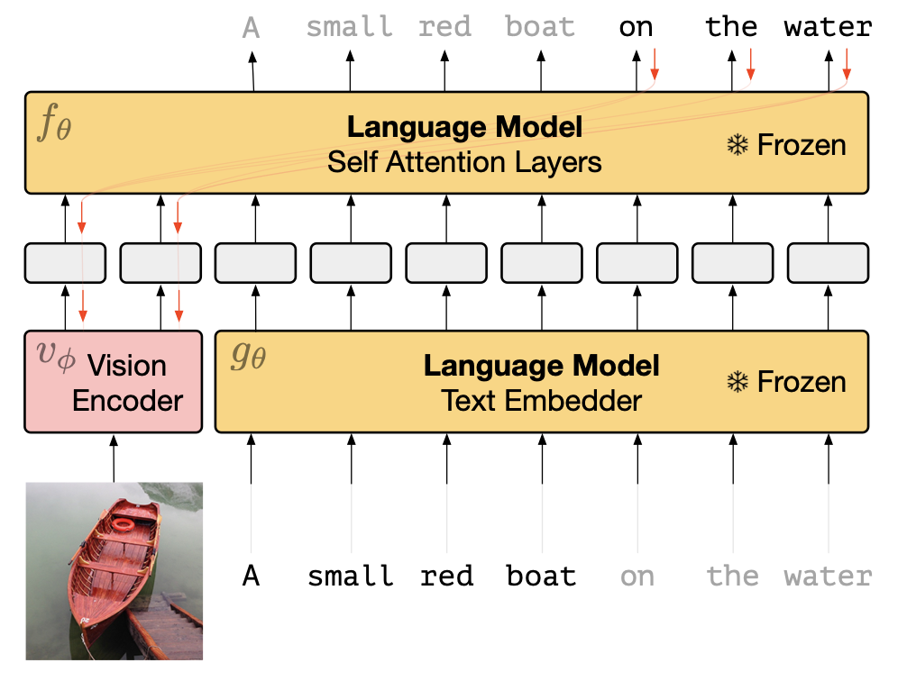

+++
author = "Laychiva Chhout"
title = "Few-shot learning with Frozen"
date = "2024-02-06"
description = "Frozen is a novel method introduced in the paper `Multimodal few-shot learning with frozen language models` by Tsimpoukelli et al. (2021) to improve the performance of few-shot learning."
math = "true"
tags = [
    "ai",
    "ml",
    "dl",
]
categories = [
    "Artificial Intelligence",
    "Deep Learning",
]
series = ["Themes Guide"]
aliases = ["migrate-from-jekyl"]
image = "frozen.png"
+++

In this blog post, I will review and give a comprehensive understanding of the "Frozen" technique, introduced in the [paper](https://arxiv.org/abs/2106.13884) by Tsimpoukelli et al. (2021), focusing on its unique approach and implications in Few-shot learning.

### Introduction

A key motivation behind this paper is to introduce "Frozen," an innovative technique that synergizes a vision encoder with a language model for Few-Shot Learning. This approach remarkably uses a few [image-caption pairs](https://aclanthology.org/P18-1238/) to substantially improve performance, demonstrating a significant leap from traditional learning methodologies. In conventional fine-tuning, all weights are updated and stored for each task, which can be resource-intensive. An alternative, [prefix-tuning](https://arxiv.org/abs/2101.00190), involves freezing the weights of the transformer and only updating the weights of the prefix for each task. However, a critical limitation of prefix-tuning is that the prefix remains static or fixed for each task, and its applicability has been confined primarily to NLP tasks.

In this blog post, we will explores the possibility of transcending these limitations by introducing a mechanism that guides the models to perform specific tasks beyond just a fixed or static prefix, and that is not limited to text-based tasks. The solution proposed is "Frozen," which significantly enhances the tuning process by incorporating image-conditionality. This allows the language model to respond in a more dynamic and context-sensitive manner. Frozen achieves dynamic adaptation by adjusting prefixed prompts based on the input image, representing a novel and effective approach to multimodal Few-Shot Learning.

### Methodology

The methodology employed in this paper is built upon two main architectural components: a Pre-trained Autoregressive Language Model (LM) and a Vision Encoder. The LM is a large transformer-based model, pre-trained on extensive text data, comprising 7 billion parameters. In contrast, the Vision Encoder, specifically an NF-ResNet-50 in this study, encodes images into a word embedding space compatible with the language model. 

A pivotal element in this approach is the integration of the Vision Encoder with the LM, a process facilitated by a *Visual Prefix*. This technique involves mapping the output of the Vision Encoder to a $D \times n$ channel, which is subsequently reshaped into $n$ vector embeddings of dimension $D$, forming a bridge between the visual and linguistic components of our model.

The training methodology is distinctive, characterized by the freezing of the LM's weights, meaning they remain unchanged (i.e., no weight update occurs). However, these static weights of the $\mathrm{LM}(\theta)$ are crucial in updating the weights of the Vision Encoder $(\phi)$. This is achieved mathematically by training the Vision Encoder to maximize the log likelihood: 
$$
\begin{aligned}
\log p_{\theta, \phi}(\mathbf{y} \mid x) & =\sum_l \log p_{\theta, \phi}\left(y_l \mid \mathbf{x}, y_1, y_2, \ldots, y_{l-1}\right) \\\
& =\sum_l f_\theta\left(i_1, i_2, \ldots, i_n, t_1, t_2, \ldots, t_{l-1}\right)_{y_l}
\end{aligned}
$$

In this formula, since the LM parameters $(\theta)$ are frozen, each element $i_k$ receives gradients calculated as $\sum_l \nabla_{i_k} f_\theta\left(i_1, i_2, \ldots, i_n, t_1, t_2, \ldots, t_{l-1}\right)_{y_l}$, which are then used to update the weights of the Vision Encoder via back-propagation.

