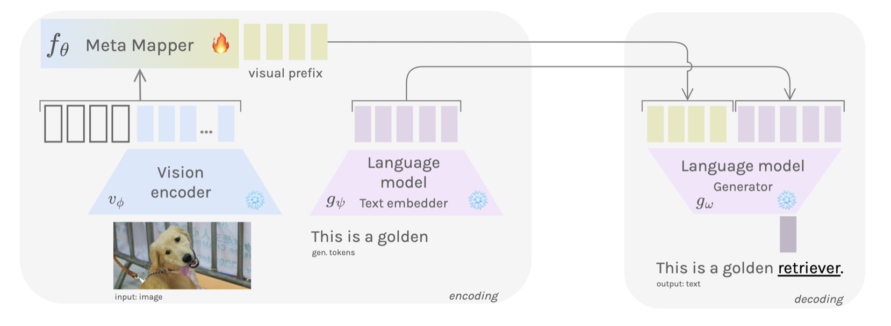

+++
author = "Laychiva Chhout"
title = "Multimodal Few-shot learning with Meta Learning"
date = "2024-02-06"
description = "In this blog post, I will give a comprehensive understanding of the `Meta Learning` method for Multimodal few-shot learning."
math = "true"
tags = [
    "ai",
    "ml",
    "dl",
]
categories = [
    "Artificial Intelligence",
    "Deep Learning",
]
series = ["Themes Guide"]
aliases = ["migrate-from-jekyl"]
image = "meta.png"
+++

### Introduction

In the preceding [blog post](https://lchhout.github.io/blogs/post/frozen/), we discussed how the "Frozen" approach leverages the pre-trained weights of language models (LM) along with image-conditionality. But this approach is however expensive because we need to fine-tune the Vision Encoder. Inspired by the efficacy of large language models (LLM) in NLP, there have been parallel developments in the vision domain, with researchers utilizing large vision models to enhance Multimodal Few-shot learning. This blog post will summarizes and give a comprehensive understanding of a paper that extends "Frozen," introducing a [meta-learning framework to Multimodal Few-shot learning](https://arxiv.org/abs/2302.14794). 

### Model Architecture

The model's architecture as shown in the Figure below comprises three primary components:

1. **Vision Encoder Network:** employing the CLIP Model\cite{radford2021learning} as a function $v_\phi$, with static parameters $\phi \in \mathbb{R}^{d_v}$, the vision encoder processes a raw image $\mathbf{x}$ and outputs visual features $v_\phi(\mathbf{x}) = x_1, \ldots, x_n$.

2. **Meta-Mapper Network:** the meta-mapper deviates from the linear mapping used in the Frozen method. It is a learnable network consisting of a set of parameters $p_i \in \mathbb{R}^{d_e}$. These parameters form a visual prefix which, when combined with the encoded features, result in the sequence $\left[p_1, \ldots, p_l, x_1, \ldots, x_n\right]$. The paper incorporates a multi-head attention block as a meta-mapper with meta-parameters $\theta$, expressed as:

$$
\operatorname{MetaMap}_\theta(Q, K, V) = \sigma\left(Q K^T\right) * V
$$ where $Q = K = V = \left[p_1, \ldots, p_l, x_1, \ldots, x_n\right]$. This function transforms the sequence of visual features into a vector of optimized parameters $p_1^\*, \ldots, p_l^\*$, which serve as the visual prefix for the language model:

$$
p_1^\*, \ldots, p_l^\* = \operatorname{MetaMap}_\theta\left(\left[p_1, \ldots, p_l, x_1, \ldots, x_n\right]\right).
$$

3. **Language Model:** The language model, denoted by $g_\omega$, is an autoregressive model, specifically GPT-2. It receives the visual prefix $p_1^\*, \ldots, p_l^\*$ and token embeddings $t_1, \ldots, t_m$, generating subsequent tokens in an autoregressive manner:
$$
t_{i+1} = g_\omega\left(\left[p_1^\*, \ldots, p_l^*, t_1, \ldots, t_i\right]\right), \quad i < m.
$$

### Training

#### Setting

The author constructs a meta-dataset divided into disjoint partitions:

- meta-training $\mathcal{D}_{\text{meta-train}}$, and 
- meta-testing $\mathcal{D}_{\text{meta-test}}$.

Specifically, the meta-training set $\mathcal{D}_{\text{meta-train}}$ comprises meta-datasets $\mathcal{D}_i$, each containing a support set $\mathcal{D}_i^{\text{tr}}$ for training.

A query set $\mathcal{D}_i^{\text{ts}}$ for testing, denoted by 

$$\mathcal{D}_{\text{meta-train}} = \left\\{(\mathcal{D}_1^{\text{tr}}, \mathcal{D}_1^{\text{ts}}), \ldots, (\mathcal{D}_n^{\text{tr}}, \mathcal{D}_n^{\text{ts}})\right\\}.$$ 

Each pair $(\mathcal{D}_i^{\text{tr}}, \mathcal{D}_i^{\text{ts}})$ is treated as a meta-task $\mathcal{T}_i$.
In a $k$-shot, $N$-way scenario, the support set $\mathcal{D}_i^{\text{tr}}$ for a given meta-task $\mathcal{T}_i$ includes $k$ labeled instances for each of the $N$ classes, where $N$ represents the total number of unique categories. 

The author defines a task distribution $p(\mathcal{T})$, where a batch of tasks 

$$\mathcal{T}_i \sim p(\mathcal{T})$$

for the $k$-shot, $N$-way challenge is generated by randomly selecting $N$ classes from the meta-train sample pool $\mathcal{D}_{\text{meta-train}}$. For each class in the support set, $k$ samples are chosen, and for the query set, $m$ samples are selected per class, with $m > k$.

#### Training

To meta-train the model, the author samples batches of multimodal few-shot learning tasks 

$$\mathcal{T}_i \sim p(\mathcal{T})$$

Each task consists of a support set $D_i^{\text{tr}}$ and a query set $D_i^{\text{ts}}$. The model, represented as a function $f_\theta$, takes an image $\mathbf{x}$ as input and produces an output $\mathbf{y}$. The cross-entropy loss function, utilized for optimization during training, is given by:

$$
\\mathcal{L}\_{\\mathcal{T}\_i}(f_{\theta}) = \sum_{\mathbf{x}^j, \mathbf{y}^j \sim D_i^{\text{tr}}} \mathbf{y}^j \log f_\theta(\mathbf{x}^j) + (1 - \mathbf{y}^j) \log (1 - f_\theta(\mathbf{x}^j))
$$

For adapting to a new task $\\mathcal{T}\_i$, the parameters $\theta$ become task-specific $\theta_i'$. These parameters are updated using the gradient descent rule $\theta\_i' = \theta - \alpha \nabla_\theta \\mathcal{L}\_{\\mathcal{T}\_i}(f_\theta)$. Subsequently, these task-specific parameters are employed to optimize the model's performance on the task:

$$
\min_\theta \sum_{\mathbf{x}^j, \mathbf{y}^j \sim D_i^{\text{ts}}} \\mathcal{L}\_{\\mathcal{T}\_i}(f_{\theta_i'}) = \sum_{\mathbf{x}^j, \mathbf{y}^j \sim \\mathcal{D}\_i^{t s}} \\mathcal{L}\_{\\mathcal{T}\_i}\left(f_{\theta-\alpha \nabla_\theta \\mathcal{L}\_{\\mathcal{T}\_i}\left(f_\theta\right)}\right),
$$

The meta-optimization across all tasks $\\mathcal{T}\_i$ is performed using SGD update rule, as follows: $$\theta \leftarrow \theta-\beta \nabla_\theta \sum_{\mathbf{x}^j, \mathbf{y}^j \sim \\mathcal{D}\_i^{t s}} \\mathcal{L}\_{\\mathcal{T}\_i}\left(f_{\theta_i^{\prime}}\right)$$ where $\beta$ is the step size hyperparameter.

$$
\\mathcal{L}\_{\\mathcal{T}\_i}(f_{\theta}) = \sum_{\mathbf{x}^j, \mathbf{y}^j \sim D_i^{\text{tr}}} \mathbf{y}^j \log f_\theta(\mathbf{x}^j) + (1 - \mathbf{y}^j) \log (1 - f_\theta(\mathbf{x}^j))
$$